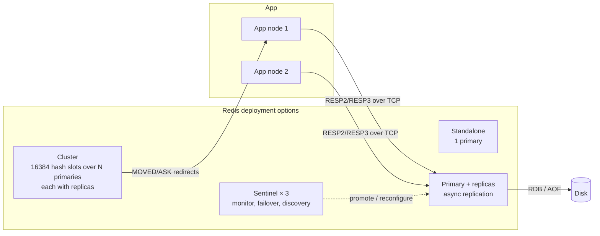

# Redis

> Concept / interview file. Implementation pair: [1.redis1.md](1.redis1.md). Rules: [.agents/rules.md](../../.agents/rules.md).
> Version anchor: Redis 7.x / 8.x OSS (2024–2026); Valkey 8 (Linux Foundation fork) where behaviour differs.

## Index
- [1. Concept](#1-concept)
  - [1.1 Why it was created](#11-why-it-was-created)
  - [1.2 Common use cases](#12-common-use-cases)
  - [1.3 Core mechanism in one picture](#13-core-mechanism-in-one-picture)
- [2. Architecture](#2-architecture)
- [3. Each component](#3-each-component)
  - [3.1 Event loop and threading model](#31-event-loop-and-threading-model)
  - [3.2 Data structures and encodings](#32-data-structures-and-encodings)
  - [3.3 Keyspace, expiry, eviction](#33-keyspace-expiry-eviction)
  - [3.4 Persistence: RDB and AOF](#34-persistence-rdb-and-aof)
  - [3.5 Replication](#35-replication)
  - [3.6 Sentinel (HA)](#36-sentinel-ha)
  - [3.7 Cluster (sharding)](#37-cluster-sharding)
  - [3.8 Transactions, Lua, Functions](#38-transactions-lua-functions)
  - [3.9 Pub/Sub, Streams, Keyspace notifications](#39-pubsub-streams-keyspace-notifications)
  - [3.10 Client-side caching, pipelining, connection model](#310-client-side-caching-pipelining-connection-model)
  - [3.11 Modules / Redis Stack: JSON, Search, Bloom, TimeSeries, vector](#311-modules--redis-stack-json-search-bloom-timeseries-vector)
  - [3.12 Security and multi-tenancy](#312-security-and-multi-tenancy)
- [4. Adapting it](#4-adapting-it)
  - [4.1 Knobs and deciding variables](#41-knobs-and-deciding-variables)
  - [4.2 Caching patterns](#42-caching-patterns)
  - [4.3 Tricks](#43-tricks)
  - [4.4 Best practices](#44-best-practices)
  - [4.5 Trade-off table](#45-trade-off-table)
  - [4.6 Patterns built on Redis](#46-patterns-built-on-redis)
- [5. Comparison](#5-comparison)
- [6. Failure modes](#6-failure-modes)
- [7. Interview questions](#7-interview-questions)
  - [7.1 Fundamentals and data structures (Q1–Q8)](#71-fundamentals-and-data-structures-q1q8)
  - [7.2 Caching (Q9–Q15)](#72-caching-q9q15)
  - [7.3 Persistence and durability (Q16–Q20)](#73-persistence-and-durability-q16q20)
  - [7.4 Replication, Sentinel, Cluster (Q21–Q28)](#74-replication-sentinel-cluster-q21q28)
  - [7.5 Concurrency, locks, atomicity (Q29–Q34)](#75-concurrency-locks-atomicity-q29q34)
  - [7.6 Messaging, streams, rate limiting, misc (Q35–Q40)](#76-messaging-streams-rate-limiting-misc-q35q40)
  - [7.7 L5-only questions](#77-l5-only-questions)
- [8. Further thinking](#8-further-thinking)
- [References](#references)

---

## 1. Concept

### 1.1 Why it was created
- Pain before (2009, Salvatore Sanfilippo, LLOOGG real-time analytics)
  - MySQL could not sustain per-page-view counters/lists at tens of thousands of writes/s on one box
  - memcached solved reads but: only opaque strings, no persistence, no replication, no server-side ops (append to list, increment inside a hash)
  - every "structure" op became read-modify-write in the app → races and extra round trips
- Prior art that failed
  - memcached: flat KV, no structures, no durability
  - RDBMS: disk-bound, lock contention on hot rows
  - in-process caches: per-node, not shared, lost on restart
- Redis's bet
  - **data structures server**: the value is a real list/hash/set/sorted set, operations run server-side atomically
  - single-threaded command execution → no locks, every command atomic by construction
  - memory as primary store, disk as optional backup (snapshot / log)
  - 🗣 "Redis is not a cache; it is a shared, network-attached data-structure library that happens to be very fast."

### 1.2 Common use cases
| Use case | Structure / feature | Why Redis fits |
| --- | --- | --- |
| Cache (DB result, session, page fragment) | String / Hash + TTL | sub-ms, eviction policies |
| Session store | Hash + TTL | shared across app nodes |
| Rate limiting | INCR + EXPIRE, sorted set sliding window, Lua | atomic counter ops |
| Distributed lock / lease | `SET NX PX` + Lua release | atomic compare-and-delete |
| Leaderboard / ranking | Sorted set (skiplist) | O(log n) rank & range |
| Queue / job scheduling | List (`BLPOP`), Sorted set by timestamp, Streams | blocking pop, consumer groups |
| Pub/sub fan-out (best effort) | PUB/SUB | fire-and-forget, low latency |
| Counting / analytics | HyperLogLog, Bitmap, INCR | fixed memory cardinality |
| Geo | GEO (sorted set underneath) | radius queries |
| Feature flags / config | Hash + keyspace notifications | push invalidation |
| ML / LLM systems | semantic cache (vector search), feature store (Hash), inference queue (Streams), online feature freshness | memory latency, vectors in Redis Stack / 8 |

### 1.3 Core mechanism in one picture
```
client ──RESP──▶ [ I/O thread(s): read/parse ] ──▶ [ single main thread: execute command on dict/skiplist/… ] ──▶ [ I/O: write reply ]
                                                          │                                              
                                                          ├─ keyspace: dict(key → robj{type, encoding, ptr, lru/lfu})
                                                          ├─ expires: dict(key → unix ms)  (lazy + active sampling)
                                                          ├─ replication buffer ──▶ replicas (async)
                                                          └─ AOF buffer ──▶ fsync policy;  fork() ──▶ RDB snapshot (COW)
```
- Three things to internalize
  - one command at a time: atomicity is free, but a slow command (KEYS, big DEL, Lua) blocks everyone
  - memory bound: every byte is RAM; eviction/expiry decide what survives
  - durability is opt-in and asynchronous by default: replication is async, AOF fsync is every second by default

---

## 2. Architecture



| Component | Single responsibility | Owned state |
| --- | --- | --- |
| Main thread | execute commands, expire, evict, serve replicas | keyspace dicts, client list |
| I/O threads (6.0+) | read/parse requests, write replies | per-client buffers |
| Background threads (bio) | lazy free (`UNLINK`), AOF fsync, close file | job queues |
| Forked child | write RDB / rewrite AOF from a COW snapshot | copy of memory pages as they change |
| Replica | replay primary's stream, serve reads (stale) | own copy of dataset, replication offset |
| Sentinel | health check, quorum vote, failover, client discovery | sentinel config epoch, known primaries |
| Cluster bus | gossip, slot ownership, failure detection, failover | slot map, node epochs |
| Client library | connection pool, pipelining, cluster slot cache, retries | slot→node map, pool |

---

## 3. Each component

### 3.1 Event loop and threading model
- Why: lock-free atomic commands; simplicity; memory ops are µs so CPU is rarely the bottleneck — network and syscalls are
- Mechanism
  - `ae` event loop (epoll/kqueue) → read → parse RESP → lookup command table → execute → append reply to client output buffer
  - 6.0 `io-threads`: parallelize **socket read/write only** (execution still single-threaded); Redis 8 / Valkey 8 push more of the I/O path (parsing, memory prefetch) to threads → order-of-magnitude 2–3× throughput on multi-core (Valkey 8 claims ~1M ops/s per node; treat as vendor number)
  - background threads for `UNLINK`, `FLUSHALL ASYNC`, AOF fsync so the main thread does not block on free()/fsync
  - `latency-monitor`, `SLOWLOG` capture commands above threshold
- Cost / limits
  - one big-O(n) command stalls all clients: `KEYS *`, `SMEMBERS` on a 10M set, `DEL` of a huge key (use `UNLINK`), long Lua
  - one core per instance for execution → scale by more instances (cluster), not more cores
- Knobs: `io-threads` (= cores−1, only helps when network-bound), `hz` (expire/evict cycle frequency), `lazyfree-lazy-*` (async free on eviction/expire/overwrite)

### 3.2 Data structures and encodings
| Type | Underlying encodings (small → large) | Key ops & complexity | Typical use |
| --- | --- | --- | --- |
| String | `int`, `embstr` (≤44 B, one allocation), `raw` (SDS) | GET/SET O(1), INCR, APPEND, GETRANGE, bit ops | cache, counter, lock, bitmap |
| Hash | `listpack` (≤128 entries, ≤64 B each) → `hashtable` | HGET/HSET O(1), HINCRBY, HGETALL O(n) | object fields, session, feature vector |
| List | `quicklist` (linked list of listpacks) | LPUSH/RPOP O(1), LRANGE O(n), BLPOP | queue, recent-N, timeline |
| Set | `intset` (all ints, ≤512) → `listpack` (7.2) → `hashtable` | SADD/SISMEMBER O(1), SINTER O(n·m) | tags, unique visitors, relations |
| Sorted set | `listpack` (≤128) → `skiplist` + `dict` | ZADD O(log n), ZRANGE O(log n + m), ZRANK | leaderboard, delay queue, sliding window |
| Stream | radix tree of listpacks + consumer-group PEL | XADD O(1), XRANGE O(log n + m), XREADGROUP | event log, work queue with acks |
| HyperLogLog | sparse → dense 12 KiB | PFADD/PFCOUNT O(1), 0.81 % error | cardinality |
| Bitmap / Bitfield | String | SETBIT/GETBIT O(1), BITCOUNT | presence per id, flags |
| Geo | sorted set (geohash score) | GEOADD, GEOSEARCH | radius search |
- Mechanism notes
  - `robj` header: type, encoding, 24-bit LRU clock or LFU (8-bit log counter + 16-bit decay time), refcount, ptr
  - SDS = length-prefixed binary-safe string, O(1) `STRLEN`, amortized append
  - dict = incremental rehash (two tables, a step per op + during cron) → no stop-the-world resize; big rehash still adds latency; cluster uses per-slot dicts (7.4+/Valkey) so slot migration is O(1) lookup
  - skiplist chosen over balanced tree: simpler range ops, `ZRANGEBYSCORE` walks forward pointers; dict alongside for O(1) score lookup
  - small-encoding thresholds (`hash-max-listpack-entries`, etc.) trade CPU (linear scan) for memory (10× smaller); tuning them is the classic memory win (Instagram 2011 post: 1M keys → hashes of 1000 buckets, ~5× less memory)
- Limits: no secondary indexes natively (use sorted sets as indexes or RediSearch); values ≤ 512 MiB; collections ≤ 2^32 elements

### 3.3 Keyspace, expiry, eviction
- Expiry mechanism
  - `expires` dict holds absolute ms timestamp
  - **lazy**: on access, if expired → delete (and propagate `DEL` to replicas/AOF — replicas never expire on their own; they wait for primary's DEL, so reads on replicas can return logically-expired keys unless client checks TTL; 6.0+ replica read returns nil for expired keys but keeps memory)
  - **active**: `hz` times/s sample 20 keys from `expires`; if > 25 % expired, repeat (bounded by time) → memory of expired keys can lag; 7.0 adds an `active-expire-effort` knob
- Eviction (`maxmemory` reached)
  | Policy | Mechanism | Choose when |
  | --- | --- | --- |
  | `noeviction` (default) | writes error OOM | Redis as a DB / queue; you'd rather fail than lose |
  | `allkeys-lru` | sample `maxmemory-samples` (5) keys, evict oldest LRU clock (approximate LRU, pool of 16 candidates) | general cache |
  | `allkeys-lfu` | log-counter with decay; evicts least frequently used | cache with hot set + scans |
  | `volatile-lru/lfu/ttl/random` | only keys with TTL | mix of cache + persistent keys in one instance (anti-pattern; separate instances better) |
  | `allkeys-random` | random | uniform access |
- Cost: eviction happens synchronously in the command path → under memory pressure every write pays eviction; large values freed lazily if `lazyfree-lazy-eviction yes`
- Fragmentation: jemalloc; `mem_fragmentation_ratio` > 1.5 → `activedefrag yes`; RSS vs `used_memory` matters for OOM-killer

### 3.4 Persistence: RDB and AOF
| Aspect | RDB snapshot | AOF (append-only file) |
| --- | --- | --- |
| Mechanism | `fork()`; child writes compact binary dump of the dataset; parent keeps serving; COW pages copied on write | every write command appended to buffer → file; `fsync` per `appendfsync`; periodic **rewrite** (fork, dump current state as minimal commands; 7.0 multi-part AOF = base RDB + incremental files) |
| Durability | lose everything since last snapshot (`save 3600 1 300 100 60 10000`) | `always` (every command, slow), `everysec` (default; ≤1 s loss), `no` (OS decides) |
| Cost | fork latency ∝ page-table size (order of magnitude 10–20 ms/GB on Linux, hedged); COW doubles memory under write load | write amplification, larger file, rewrite fork cost; replay on restart slower than RDB load |
| Restart speed | fast (binary load) | slower (replay), 7.0 base-RDB helps |
| Choose | backups, replicas' initial sync, cache tier | anything where losing > seconds of writes is unacceptable |
- Both on (`appendonly yes` + `save`) is the common production setting; AOF used for restart, RDB for backup/replication
- Defeaters
  - `everysec` still loses up to 1 s; `always` still loses data on power loss unless disk honors fsync
  - fork on huge instance with THP enabled → multi-second stall; disable transparent huge pages
  - no persistence at all (`save ""`, `appendonly no`) is legitimate for pure caches but then a restart = cold cache = thundering herd on the DB

### 3.5 Replication
- Mechanism
  - replica sends `PSYNC <replid> <offset>`; primary either **full sync** (fork → RDB → send; buffer writes meanwhile; `repl-diskless-sync` streams directly from socket) or **partial resync** from the **replication backlog** (ring buffer, `repl-backlog-size` 1 MiB default → raise to minutes of write traffic)
  - after sync, primary streams every write command (same as AOF stream); replica applies in order; replica tracks offset
  - **asynchronous**: primary acks the client before replicas receive → failover can lose acked writes
  - `WAIT n timeout` (semi-sync): block until n replicas acknowledged the offset — does not make it a consensus write; failover can still pick a replica that lacks it
  - `min-replicas-to-write` / `min-replicas-max-lag`: primary refuses writes if fewer than n replicas within lag → bounds loss window
  - replicas are read-only (`replica-read-only`), serve stale reads; chained replication allowed
  - replica lag under load: replica applies single-threaded too; big keys / Lua slow down replay
- Deciding variables: `repl-backlog-size` (minutes of writes × write rate), `repl-diskless-sync` (fast disks? no → diskless), `min-replicas-*` (loss tolerance vs availability)

### 3.6 Sentinel (HA)
- Why: primary dies → someone must promote a replica and tell clients; no human at 3 a.m.
- Mechanism
  - ≥3 sentinel processes ping primary/replicas; **SDOWN** (subjectively down after `down-after-milliseconds`) → ask peers → **ODOWN** when `quorum` agree
  - leader election among sentinels (Raft-like, epoch) → leader picks best replica (priority, replication offset, run id) → `REPLICAOF NO ONE` → reconfigures others → publishes `+switch-master`
  - clients ask sentinels for the current primary (`SENTINEL get-master-addr-by-name`) and subscribe to switch events
- Costs / limits
  - split brain: old primary isolated with clients still writing → lost when it rejoins as replica; mitigate with `min-replicas-to-write 1` on primary (writes stop when it can't see replicas)
  - failover time = down-after + election + reconfig (order of magnitude 10–30 s with defaults); no sharding
  - quorum counts for ODOWN only; the failover itself needs majority of all sentinels

### 3.7 Cluster (sharding)
- Why: single instance bounded by one core and one box's RAM; need horizontal writes
- Mechanism
  - key → `CRC16(key) mod 16384` **hash slot**; `{hashtag}` forces keys to same slot (`user:{42}:profile`, `user:{42}:cart`)
  - each primary owns a slot range; replicas per primary; slot map gossiped over the **cluster bus** (port+10000)
  - client sends to any node; wrong node → `-MOVED slot host:port` (client updates map) or `-ASK` (during migration, one-off redirect + `ASKING`)
  - resharding: `CLUSTER SETSLOT … MIGRATING/IMPORTING`, keys moved with `MIGRATE`; live but slower during move
  - failure: primaries gossip PFAIL → FAIL by majority; replica of failed primary starts election (rank by offset), needs majority of primaries' votes → promoted; `cluster-node-timeout` (15 s) governs detection
  - **no multi-key ops across slots** (`MGET` across slots fails unless same hashtag); transactions/Lua limited to one slot
  - `cluster-require-full-coverage yes`: any slot unowned → whole cluster refuses writes (availability vs consistency choice)
- Costs: clients must be cluster-aware; hot slot/hot key still lands on one node; cross-slot logic moves to app; minimum 3 primaries + 3 replicas
- Deciding variables: number of primaries = total memory ÷ per-node budget (keep nodes ≤ ~25–50 GB for fork/failover time, hedged); replicas per primary = 1 (2 for zone loss); `cluster-node-timeout` (false failover vs detection time)

### 3.8 Transactions, Lua, Functions
- `MULTI`/`EXEC`
  - queues commands; executes all in one go, atomically w.r.t. other clients; **no rollback** (a failing command inside still lets others run); `WATCH key` = optimistic CAS: EXEC aborts if watched key changed
  - use for "all-or-nothing visibility", not for conditional logic (no way to read inside and branch)
- Lua (`EVAL`/`EVALSHA`)
  - script runs atomically on the main thread; can read, branch, write → the tool for check-and-set logic (locks, rate limiters, inventory decrement)
  - cost: blocks everything for its duration (`busy-reply-threshold` / `lua-time-limit` 5 s → then only `SCRIPT KILL` if no writes yet); script cache is per node, `NOSCRIPT` → resend with EVAL; keys must be declared in `KEYS[]` for cluster routing
- Functions (7.0): libraries loaded once (`FUNCTION LOAD`), persisted in RDB/AOF and replicated → replaces EVALSHA fragility
- Replication of scripts: effects replicated (`EVAL` effects as commands) since 5.0 default → non-deterministic scripts safe

### 3.9 Pub/Sub, Streams, Keyspace notifications
| Feature | Mechanism | Guarantee | Use |
| --- | --- | --- | --- |
| PUB/SUB | publisher → server → every subscribed connection immediately; no storage | at-most-once; disconnected subscriber misses everything | cache invalidation broadcast, chat presence, live UI |
| Sharded Pub/Sub (7.0) | channel hashed to slot → only that shard's nodes | same, but scales in cluster (regular pub/sub broadcasts to all nodes) | cluster fan-out |
| Streams (5.0) | append-only log keyed by `ms-seq` id; `XREAD` tail; **consumer groups**: each entry delivered to one consumer, tracked in the **PEL** until `XACK`; `XAUTOCLAIM`/`XPENDING` to recover from dead consumers; `MAXLEN ~` trimming | at-least-once with groups; persistent as any key; single node per stream (no partitioning → shard by key yourself) | job queues with acks, event log, inference request queue |
| Keyspace notifications | `notify-keyspace-events` → pub/sub messages on key events (expire, set, del) | best effort, fires on the node where event occurs; expired events fire when the key is actually deleted, not at logical TTL | TTL-based scheduling (unreliable), cache coherence |
- Streams vs Kafka: Redis stream is one key on one node (memory-bound, throughput of one core), no replication ack, no log compaction; Kafka is partitioned/durable/replayable at disk scale (see [../2.messaging/1.kafka.md](../2.messaging/1.kafka.md))

### 3.10 Client-side caching, pipelining, connection model
- Pipelining: send N commands without waiting → one RTT + one syscall batch; throughput order-of-magnitude 5–10× for small ops; server buffers replies (`client-output-buffer-limit`)
- Client-side caching (6.0, RESP3 tracking): server remembers which keys a client read and pushes invalidation when they change; **default mode** (per-client key tracking, memory on server) or **broadcast mode** (prefix-based); app keeps a local map → sub-µs reads, coherence within one round trip
- Connections: each connection has input/output buffers; `maxclients` 10000; use pools; `CLIENT PAUSE` for controlled failover; `timeout`/`tcp-keepalive` for dead peers
- RESP3: typed replies, push messages (tracking, pub/sub on same connection)

### 3.11 Modules / Redis Stack: JSON, Search, Bloom, TimeSeries, vector
- RedisJSON: JSON documents with path ops (`JSON.SET key $.a.b 1`); RediSearch: secondary indexes (text, numeric, tag, geo) over Hash/JSON + **vector similarity** (FLAT exact, HNSW approximate, `KNN` query, hybrid filters) — now built into Redis 8 core; RedisBloom: Bloom / Cuckoo filters, Count-Min, Top-K; RedisTimeSeries: downsampling, retention, aggregation
- ML relevance: **semantic cache** for LLM (embedding of prompt → HNSW nearest → return cached completion if cosine ≥ threshold), feature store with vector fields, session memory for agents
- Licensing: Redis 7.4 moved to RSALv2/SSPL (2024); Redis 8 re-added AGPL option (2025); Valkey (BSD) is the fork carried by AWS/Google/Oracle — matters when choosing a managed offering (ElastiCache supports both)

### 3.12 Security and multi-tenancy
- ACLs (6.0): users with command/key/channel patterns (`ACL SETUSER app on >pw ~cache:* +@read +@write -@dangerous`)
- TLS (6.0), `protected-mode`, `rename-command` (legacy) → prefer ACL categories
- Multi-tenancy: logical DBs (`SELECT n`) are weak isolation (shared memory, single thread, not in cluster) → separate instances or key prefixes + ACL; per-client output buffer limits stop one slow subscriber from OOM-ing the server

---

## 4. Adapting it

### 4.1 Knobs and deciding variables
| Goal | Knob set | Deciding variable |
| --- | --- | --- |
| Cache that never OOMs | `maxmemory`, `allkeys-lru` or `-lfu`, `lazyfree-lazy-eviction yes` | hit ratio vs scan resistance (LFU for scans) |
| Durability | `appendonly yes`, `appendfsync everysec`, `save` schedule, `min-replicas-to-write` | acceptable loss window in seconds |
| Low tail latency | avoid big keys/O(n) commands, `io-threads`, disable THP, `hz`, `activedefrag` | p99 target, key size distribution |
| HA without sharding | primary + 2 replicas + 3 sentinels, `down-after-milliseconds`, `min-replicas-*` | failover time vs false positives |
| Scale writes / memory | Cluster, primaries count, hashtags for co-location | dataset size ÷ node budget, multi-key op needs |
| Memory efficiency | small-encoding thresholds, short keys, Hash instead of many Strings, `int` encodings, TTL everything | per-entry overhead (~50–90 B per key, hedged) |
| Replica read scaling | `replica-read-only`, client `READONLY` in cluster, accept staleness | staleness tolerance |
| Safe failover for clients | `WAIT`, `CLIENT PAUSE WRITE` during planned failover | zero-loss planned maintenance |

### 4.2 Caching patterns
| Pattern | Flow | Consistency risk | Use when |
| --- | --- | --- | --- |
| **Cache-aside** (lazy) | app: GET → miss → DB → SET with TTL; on write: update DB then `DEL` cache | race: reader loads stale between DB write and DEL; stale for TTL if DEL fails | default for read-heavy |
| Read-through | cache library loads on miss | same, encapsulated | Spring Cache, DAX-like |
| Write-through | write cache + DB synchronously | cache holds unread data; DB and cache can diverge on partial failure | read-after-write consistency needed |
| Write-behind | write cache, async flush to DB | loss on cache failure | write-heavy, loss tolerable |
| Refresh-ahead | refresh hot keys before TTL | wasted work for cold keys | predictable hot set |
- Delete vs update on write: **delete** (invalidate) is safer (no stale-write ordering problem between two concurrent writers); "delayed double delete" mitigates the read-load-stale race; CDC-driven invalidation (Debezium → Redis DEL) removes the dual-write from the app
- Problems and fixes
  | Problem | Mechanism | Fix |
  | --- | --- | --- |
  | Cache penetration | requests for non-existent keys always miss → DB | cache null with short TTL; Bloom filter of existing ids |
  | Cache stampede / breakdown | hot key expires → thousands of concurrent DB loads | per-key mutex (`SET lock NX PX`), single-flight in app, logical expiry (serve stale, refresh async), jittered TTL |
  | Cache avalanche | many keys expire at once (same TTL) or node dies | TTL jitter, replicas + sentinel, warmup on start |
  | Hot key | one key > one node's capacity | local L1 cache with tracking, replicate key to N copies (`key:{0..n}`), read replicas |
  | Big key | 100 MB list / 1M-member set → blocks thread, replication stalls | split into shards, `UNLINK`, `SCAN`-style pagination, `--bigkeys` audit |
  | Stale after failover | async replication lost the last writes | design for cache = reconstructible; for non-cache data use `WAIT` or a DB |

### 4.3 Tricks
- **Logical expiry**: store `{value, expireAt}` with a longer physical TTL; on logical expiry serve stale and let one client refresh (lock) → no stampede, bounded staleness
- **Hash bucketing**: `HSET user:{id/1000} id json` → listpack encoding, ~5–10× memory saving for many small objects
- **Sorted set as delay queue**: score = run-at ms; worker `ZRANGEBYSCORE 0 now LIMIT 0 100` + `ZREM` in Lua (atomic claim)
- **Sliding-window rate limit in Lua**: `ZREMRANGEBYSCORE key 0 now-window; ZCARD; ZADD; EXPIRE` atomically
- **Lock with fencing token**: `INCR lock:token` on acquire; downstream rejects lower tokens → tolerates lock expiry during GC pause (Kleppmann's critique of Redlock)
- **Pipelining + `MGET`/`HMGET`** instead of N round trips; batch invalidations with `UNLINK k1 k2 …`
- **Client-side tracking** for config/flags read millions of times per second
- **`SCAN` with `MATCH`/`COUNT`** for any keyspace iteration; never `KEYS` in prod
- **Semantic cache for LLM**: key = embedding, `FT.SEARCH … KNN 1 @vec $q` with score threshold; store completion + model version in JSON; TTL by content freshness
- **`OBJECT FREQ` / `MEMORY USAGE`** to find hot/big keys; `redis-cli --hotkeys` (LFU) / `--bigkeys`

### 4.4 Best practices
| Rule | Failure it prevents |
| --- | --- |
| Set `maxmemory` + an eviction policy on every cache instance | OOM kill / swapping → multi-second stalls |
| TTL on every cache key, with jitter | avalanche, unbounded growth |
| Never `KEYS`, `FLUSHALL` sync, `SMEMBERS`/`HGETALL` on unbounded collections in prod | main-thread stall for all clients |
| Keep values small (< ~10 KB, hedged) and collections bounded | big-key latency, replication lag |
| Separate instances for cache vs durable data vs queues | eviction policy conflict, one workload starving another |
| `appendonly yes` + `everysec` for anything not reconstructible | loss on restart |
| ≥ 3 sentinels across failure domains, or cluster with replicas in other AZs | no failover / split brain |
| Raise `repl-backlog-size` to cover minutes of writes | full resync storms after brief network blips |
| Disable THP, set `vm.overcommit_memory=1` | fork stalls, `BGSAVE` failures |
| Release locks with Lua compare-and-delete, always with TTL | deleting someone else's lock; deadlock on crash |
| Treat cache as reconstructible; never the only copy | data loss on failover/eviction |
| Monitor `used_memory` vs `maxmemory`, `evicted_keys`, hit ratio, `rejected_connections`, latency p99, replication lag | silent degradation |

### 4.5 Trade-off table
| Option | Buys you | Costs you | Choose when |
| --- | --- | --- | --- |
| No persistence | fastest, no fork | cold restart, herd on DB | pure cache with warmup plan |
| RDB only | cheap backups, fast restart | minutes of loss | cache + occasional snapshot |
| AOF everysec (+RDB) | ≤1 s loss | write amp, rewrite forks | sessions, counters, queues |
| AOF always | ~0 loss on crash | throughput ÷ 5–10 (hedged), still not replicated | rarely; use a DB instead |
| Sentinel | HA on one dataset, simple clients | no sharding, 10–30 s failover | dataset fits one node |
| Cluster | horizontal memory + writes | client complexity, no cross-slot ops, more nodes | > one node of RAM or > one core of writes |
| Proxy (Twemproxy, Envoy, managed cluster-mode-disabled) | simple clients over shards | extra hop, proxy is a bottleneck/SPOF | legacy clients |
| LRU | classic recency | scan pollution | mixed |
| LFU | scan-resistant | warmup, counter decay tuning | hot-set-dominated |
| Lua for logic | atomic multi-step | blocks main thread; cluster single-slot | locks, rate limits, inventory |
| WAIT | bounded replication loss | latency, still not consensus | important-but-not-critical writes |

### 4.6 Patterns built on Redis
```
Cache-aside:   app → GET k → miss → DB → SETEX k ttl v          write: DB → DEL k (→ delayed DEL again)
Lock:          SET lock:{res} token NX PX 30000 → work → EVAL "if GET==token then DEL"
Rate limit:    fixed window INCR+EXPIRE | sliding ZSET in Lua | token bucket in Lua (tokens, last_refill in Hash)
Leaderboard:   ZINCRBY board 10 user → ZREVRANK / ZREVRANGE WITHSCORES
Job queue:     Streams XADD → XREADGROUP → XACK ; XAUTOCLAIM stale ; DLQ = separate stream after N deliveries
Delay queue:   ZADD due <run_at> job → Lua claim due ≤ now
Session:       HSET sess:{id} … + EXPIRE, sliding on access
Idempotency:   SET idem:{key} result NX EX 86400
Dedup/Bloom:   BF.ADD seen id → skip if BF.EXISTS
Presence:      SETEX online:{uid} 60 1 ; heartbeat ; SCAN/Set for lists
Semantic cache: JSON + vector index → KNN by prompt embedding
```

---

## 5. Comparison

| Option | What it is | Strength | Weakness | Choose when |
| --- | --- | --- | --- | --- |
| **Redis** | in-memory data-structure server; optional persistence, replication, cluster | rich structures, Lua atomicity, Streams, modules (JSON/search/vector), ecosystem | single-threaded execution per node, memory cost, async replication (loss on failover), license churn (7.4+) | cache + structures + light queues + locks; default |
| **Valkey** | BSD fork of Redis 7.2 (Linux Foundation, 2024) | API-compatible, multi-threaded I/O in 8.x, per-slot dicts, no license risk | modules ecosystem younger (has JSON/Bloom/Search 8.x), diverging over time | managed cloud (ElastiCache/MemoryStore) or license-sensitive |
| **Memcached** | multi-threaded flat KV cache | simpler, scales across cores in one process, tiny per-item overhead, predictable | strings only, no persistence/replication/structures, no atomic multi-step (CAS only) | pure large-object cache, very high core count boxes |
| **Dragonfly** | multi-threaded Redis-compatible (shared-nothing per core) | order-of-magnitude higher throughput per node, snapshot without fork | younger, BSL license, not full command parity | single big node needing millions ops/s |
| **KeyDB** | multi-threaded Redis fork (Snap) | active-replica, flash tier | maintenance slowed | legacy |
| **Amazon ElastiCache / MemoryDB** | managed Redis/Valkey; MemoryDB = multi-AZ durable (transaction log) | no ops, MemoryDB gives durability + strong consistency on primary | cost, MemoryDB write latency higher | AWS-native; MemoryDB when Redis-as-primary-DB |
| **Hazelcast / Apache Ignite** | JVM in-memory data grid, embedded or client-server | near-cache, compute on data, SQL, Java-native | JVM ops, heavier | Java monolith needing embedded distributed cache |
| **etcd / ZooKeeper** | consensus KV (Raft/ZAB) | linearizable, watches, real leases/locks | low throughput, small values | leader election, config, locks that must be correct |
| **Kafka (Streams)** | durable partitioned log | replay, scale, durability | not a cache, ms latency | messaging at scale (see kafka.md) |

- Pick
  - deciding variable = **do you need server-side data structures / atomic multi-step ops?** yes → Redis (or Valkey); no, just bytes → Memcached is cheaper per core, but most teams still pick Redis for one runtime
  - second variable = **correctness of coordination**: locks/leader election that must never double-grant → etcd/ZooKeeper (consensus), Redis lock only with fencing tokens
  - third = **durability as primary store** → MemoryDB or a real DB; Redis persistence is best-effort
  - 🗣 "Redis for speed with structures; Memcached for bytes at scale; etcd when being wrong is worse than being slow."

---

## 6. Failure modes

| Failure | Trigger | Detection | Mitigation |
| --- | --- | --- | --- |
| Main-thread stall | `KEYS`, big `DEL`, `HGETALL` on huge hash, long Lua, `FLUSHALL` sync | `SLOWLOG`, `latency latest`, p99 spike for all clients | ban commands via ACL, `UNLINK`, `SCAN`, split big keys, script timeouts |
| Fork stall | `BGSAVE`/AOF rewrite on large instance, THP on | `latency-monitor` fork event, `INFO` `latest_fork_usec` | smaller instances, disable THP, schedule rewrites off-peak, diskless replication |
| OOM / eviction storm | no `maxmemory`, growth without TTL, big values | `used_memory` ≈ `maxmemory`, `evicted_keys`, RSS > RAM, swap | `maxmemory` + policy, TTLs, memory audit |
| Lost writes on failover | async replication, old primary had unreplicated writes | `master_repl_offset` gap, app-level inconsistencies | `min-replicas-to-write`, `WAIT`, treat as cache, MemoryDB/DB for critical |
| Split brain | network partition; old primary still accepts writes | two nodes claiming primary; sentinel `+switch-master` while old reachable | `min-replicas-to-write 1`, `min-replicas-max-lag 10`, clients follow sentinel |
| Full resync storm | backlog too small, replica reconnect after blip | `sync_full` counter increments, primary CPU/bandwidth spike | bigger `repl-backlog-size`, `repl-diskless-sync`, stagger |
| Cache stampede | hot key expired / cache flushed / restart cold | DB QPS spike coinciding with cache misses | mutex/single-flight, logical expiry, warmup, jitter |
| Hot key / hot slot | celebrity key, poor hashtag choice | one node CPU high, `--hotkeys`, uneven `INFO commandstats` | local cache + tracking, key replication, re-hashtag |
| Client output buffer overflow | slow subscriber, huge reply | `client-output-buffer-limit` disconnects, `INFO clients` | limits per class, bounded replies, faster consumers |
| Cluster unavailable | slot uncovered (primary + replicas down) with `require-full-coverage yes` | `CLUSTERDOWN` errors | replicas across AZs, set coverage no if partial availability acceptable |
| Lock double-grant | lock TTL expired mid-work (GC pause), clock jump | duplicate side effects | fencing tokens, shorter work under lock, watchdog extend, or etcd |
| Expired keys still in memory | active expire cycle can't keep up, replicas wait for DEL | `expired_keys` low while memory high, replica memory > primary | `active-expire-effort`, TTL spread, shorter cycles |
| Persistence write failure | disk full, permissions | `stop-writes-on-bgsave-error yes` → writes rejected (`MISCONF`) | monitor `rdb_last_bgsave_status`, disk alerts |
| Connection exhaustion | no pooling, leaked connections | `rejected_connections`, `connected_clients` ≈ `maxclients` | pools, `timeout`, `maxclients` |

---

## 7. Interview questions

### 7.1 Fundamentals and data structures (Q1–Q8)

**Q1:** Why is Redis fast?

**L4 answer**
- in-memory; single-threaded execution avoids locks; efficient data structures (dict, skiplist); RESP is cheap to parse; epoll event loop; pipelining amortizes RTT; I/O threads for socket work

**L5 answer**
- L4 plus:
  - mechanism: the bottleneck is syscalls and network, not CPU; a GET is ~100 ns of work vs ~50 µs of RTT → single thread keeps latency predictable and code lock-free
  - trade-off: one core per instance; horizontal scaling by more processes (cluster); any O(n) command is a global stall
  - at scale: throughput per node saturates order of magnitude 100k–200k ops/s single-threaded, 2–5× with io-threads (hedged); beyond that shard
  - context: Dragonfly/Valkey 8 shared-nothing threading for single-node scale; Memcached if only bytes

**Q2:** Explain the main Redis data types and one real use for each.

**L4 answer**
- String (cache/counter), Hash (object/session), List (queue/timeline), Set (tags/unique), Sorted set (leaderboard/delay queue), Stream (log/queue with acks), HyperLogLog (unique counts), Bitmap (presence), Geo (nearby)

**L5 answer**
- L4 plus: encodings and thresholds (listpack → hashtable, intset, skiplist+dict); why sorted set uses skiplist (range ops, simpler than tree under single thread); memory: many small strings vs bucketed hashes (Instagram pattern); complexity edges: `LINDEX` O(n), `SINTER` O(n·m), `ZRANGE` O(log n + m); choose structure by the operation you need atomic, not by shape of data

**Q3:** How does key expiration work, and what are its edges?

**L4 answer**
- TTL stored in a separate dict; lazy deletion on access; active sampling 10×/s deletes expired keys; memory of expired-but-unsampled keys can persist; replicas expire only via primary's DEL

**L5 answer**
- L4 plus: active cycle samples 20 keys and loops while > 25 % expired (time-bounded) → mass same-second expiry can lag seconds; keyspace `expired` notifications fire at physical deletion; replicas return nil for logically expired keys (since 3.2) but keep memory; TTL is not a scheduler — for scheduling use sorted set delay queue; `active-expire-effort` and TTL jitter as knobs

**Q4:** What happens when Redis hits `maxmemory`?

**L4 answer**
- depends on `maxmemory-policy`: `noeviction` → writes fail with OOM; `allkeys-lru/lfu` evicts sampled keys; `volatile-*` evicts only TTL keys; eviction happens before executing the write

**L5 answer**
- L4 plus: approximate LRU via 24-bit clock + sampling pool (`maxmemory-samples`), LFU log counter with decay; eviction is synchronous → latency under pressure; big values freed lazily; RSS vs used_memory (fragmentation) can OOM-kill before eviction; separate instances so eviction never touches durable keys; LFU when scans (batch jobs) pollute LRU

**Q5:** Hash vs many String keys for storing user profiles?

**L4 answer**
- Hash groups fields under one key: fewer keys, field-level get/set, one TTL per object; Strings allow per-field TTL and simpler cluster distribution; Hash with small field count gets compact listpack encoding

**L5 answer**
- L4 plus: per-key overhead (dict entry + robj + SDS + expires entry, order of magnitude 50–90 B) makes millions of tiny strings expensive; listpack Hash of ≤128 fields ≤64 B each is ~10× denser; downside: listpack ops are O(n) and a Hash is one key on one cluster node (hot key risk); no per-field TTL (7.4 adds `HEXPIRE`)

**Q6:** How do you find and fix big keys and hot keys?

**L4 answer**
- `redis-cli --bigkeys` / `--memkeys` / `--hotkeys` (LFU), `MEMORY USAGE`, `OBJECT FREQ`, `SLOWLOG`, `INFO commandstats`; fix by splitting collections, using `UNLINK`, local caching, replicating hot keys

**L5 answer**
- L4 plus: big key harms: blocks thread on serialize/free, replication and AOF rewrite stall, unbalanced cluster node; hot key: single core saturates regardless of cluster size → client-side tracking (RESP3) or app-level L1 with short TTL, or N copies with random suffix; monitoring approach: sample `MONITOR` on replica briefly, proxy stats, or keyspace sampling job

**Q7:** MULTI/EXEC vs Lua vs WATCH — when to use each?

**L4 answer**
- MULTI/EXEC: batch executed atomically, no branching, no rollback; WATCH: optimistic check-and-EXEC; Lua: atomic script with logic (read → decide → write); Functions persist scripts

**L5 answer**
- L4 plus: Lua blocks the server for its duration → keep scripts µs-scale, declare keys for cluster routing; WATCH suffers under contention (retry loops); MULTI queueing errors abort, runtime errors don't; replication of scripts is effects-based; Functions fix `NOSCRIPT` after failover; anti-pattern: Lua as a general compute engine

**Q8:** Pipelining vs transactions vs batching commands like MGET.

**L4 answer**
- pipelining = send many commands without waiting for replies (network optimization, not atomic); MULTI = atomic execution; MGET/HMGET = single command variadic; combine: pipeline of MGETs

**L5 answer**
- L4 plus: pipelining also reduces syscalls (one read/write per batch) → server CPU per op drops; risk: huge pipeline inflates client output buffer and blocks other clients while replies are generated; interleaving with other clients is possible between pipelined commands (not with MULTI); cluster: pipeline must be split per node by the client library

### 7.2 Caching (Q9–Q15)

**Q9:** Explain cache-aside and its consistency problems.

**L4 answer**
- read: cache miss → DB → populate; write: DB then delete cache; stale window when delete fails or when a reader loaded old value between DB write and delete; TTL bounds staleness

**L5 answer**
- L4 plus: race analysis — reader misses, reads DB (old), writer updates DB + deletes, reader writes old value → stale until TTL; mitigations: delayed double delete, versioned values (compare version on SET via Lua), CDC-driven invalidation (Debezium → DEL) which removes the app dual-write; write-through gives read-your-writes at write-latency cost; choose delete over update to avoid write-ordering races between two writers

**Q10:** How do you prevent a cache stampede on a hot key?

**L4 answer**
- per-key lock (`SET lock NX PX`) so one request rebuilds while others wait or serve stale; logical expiry with background refresh; TTL jitter; request coalescing in the app (single-flight)

**L5 answer**
- L4 plus: probabilistic early expiration (XFetch: refresh with probability rising as TTL nears) avoids lock contention; serve-stale requires storing expiry in the value; at scale the lock itself becomes a hot key → local single-flight first, Redis lock second; measure: DB QPS at key expiry boundaries

**Q11:** Cache penetration and cache avalanche — define and mitigate.

**L4 answer**
- penetration: queries for keys that don't exist bypass cache → cache nulls with short TTL, Bloom filter of valid ids; avalanche: many keys expire together or cache node dies → TTL jitter, HA (replica + sentinel), warmup, rate limit DB

**L5 answer**
- L4 plus: Bloom filter false positives are fine (extra DB hit), no false negatives; keep the filter rebuilt from DB periodically; avalanche after restart with no persistence → RDB snapshot for warm restart or pre-warm job; circuit breaker on DB path degrades gracefully instead of cascading

**Q12:** LRU vs LFU in Redis — which and why?

**L4 answer**
- LRU evicts least recently accessed (approximate, sampling); LFU evicts least frequently accessed with decay; LFU resists one-off scans polluting cache; LRU simpler, adapts faster to changing hot set

**L5 answer**
- L4 plus: Redis LRU samples 5 keys and keeps a 16-entry pool → close to true LRU at 10 samples; LFU counter is 8-bit logarithmic (`lfu-log-factor`) with `lfu-decay-time` minutes; choose LFU when hit ratio matters and access is skewed with periodic bulk reads; validate with hit-ratio A/B on a replica shadow

**Q13:** Where should sessions live — Redis, DB, JWT?

**L4 answer**
- Redis Hash with sliding TTL is standard: fast, shared across nodes, revocable; JWT stateless but not revocable without a blocklist (which is Redis again); DB too slow/hot

**L5 answer**
- L4 plus: durability: session loss on failover means re-login → acceptable? if not, AOF everysec + replicas + `min-replicas-to-write`; sizing: sessions × size ≤ maxmemory with `volatile-lru` fallback; per-user session index (Set) for "log out everywhere"; cluster: hashtag by user id to keep session + index co-located

**Q14:** How do you make cache and DB consistent under concurrent writers?

**L4 answer**
- you can't get strict consistency from two systems without a transaction; best effort: DB write then DEL, retry delete via outbox/CDC; version numbers to reject stale SET; short TTL as backstop

**L5 answer**
- L4 plus: define the consistency you need — read-your-writes for the writer (write-through or bypass cache for that user briefly) vs bounded staleness for others (TTL); CDC ordering gives per-row order of invalidations; for strong reads, read DB (cache only for tolerant paths); 🗣 "a cache is a consistency budget you spend deliberately"

**Q15:** What is client-side caching in Redis 6 and when is it worth it?

**L4 answer**
- server tracks keys a client read and pushes invalidations (RESP3) so clients keep a local in-process cache safely; modes: default (per-client key set) or broadcast (prefixes)

**L5 answer**
- L4 plus: default mode costs server memory per tracked key (`tracking-table-max-keys` evicts and sends invalidations); broadcast mode trades bandwidth for no server memory; invalidation is per key, so a local cache is coherent within one RTT; worth it for read-heavy hot keys (config, flags, small reference data) — turns a hot key problem into a local-memory read; failure: reconnect → flush local cache

### 7.3 Persistence and durability (Q16–Q20)

**Q16:** RDB vs AOF — mechanism and choice.

**L4 answer**
- RDB: periodic fork + binary snapshot; compact, fast restart, loses since-last-snapshot; AOF: append every write, fsync policy (`everysec` default), rewrite to compact; less loss, bigger, slower restart; use both in prod for durable data, none for pure cache

**L5 answer**
- L4 plus: fork COW cost ∝ RSS and write rate (memory can double); 7.0 multi-part AOF (base RDB + incremental) speeds restart; `everysec` fsync in background thread, main thread blocks only if fsync lags > 2 s; `always` still isn't replicated durability; choose by RPO: seconds → AOF everysec; minutes → RDB; zero → not Redis alone (MemoryDB or DB)

**Q17:** Why does BGSAVE cause latency spikes and how do you avoid them?

**L4 answer**
- fork copies page tables (ms per GB) and COW duplicates written pages; THP makes pages 2 MB so COW is worse; mitigate: smaller instances, disable THP, run snapshots on replicas, schedule off-peak

**L5 answer**
- L4 plus: `latest_fork_usec` metric; `repl-diskless-sync` avoids disk but not fork; Dragonfly-style fork-less snapshot is the structural fix; memory planning: reserve up to 2× RSS during snapshot under heavy writes; `vm.overcommit_memory=1` to keep fork from failing

**Q18:** Can Redis lose acknowledged writes? Enumerate the ways.

**L4 answer**
- yes: crash before AOF fsync (≤1 s); failover to a replica missing async-replicated writes; eviction under `allkeys-*`; TTL; `FLUSHALL`; disk failure with RDB only

**L5 answer**
- L4 plus: `WAIT` bounds but doesn't eliminate (no leader-lease consensus); `min-replicas-to-write` converts loss into unavailability; Sentinel picks the replica with highest offset but that replica may still trail; MemoryDB writes to a multi-AZ transaction log before ack → real durability at higher write latency; design principle: keep Redis reconstructible or accept the RPO explicitly

**Q19:** Design backups and restore for a 50 GB Redis.

**L4 answer**
- RDB snapshots from a replica on schedule, copy to object storage, retain by policy; restore = place `dump.rdb`, start, verify `dbsize`; AOF for point-in-time within a day

**L5 answer**
- L4 plus: 50 GB on one node = long fork and long full resync → consider cluster of smaller nodes; restore time ≈ load rate (order of magnitude GB/min, hedged) → warm-standby replica is the real RTO tool; test restores; encrypt at rest; for cluster, snapshot per shard and restore slot map consistently

**Q20:** What does `WAIT` guarantee and not guarantee?

**L4 answer**
- blocks until N replicas acknowledged the client's writes (by replication offset) or timeout; returns count; makes loss less likely but not impossible

**L5 answer**
- L4 plus: replicas ack after applying to memory, not after their own fsync (`WAITAOF` in 7.2 adds local/replica fsync); failover election isn't tied to WAIT'd offsets → can still promote a lagging replica in edge cases; adds one replication RTT to the write; use for "important" writes (e.g. lock acquisition) not as consensus

### 7.4 Replication, Sentinel, Cluster (Q21–Q28)

**Q21:** How does Redis replication work?

**L4 answer**
- replica connects, PSYNC; primary does full sync (RDB transfer) or partial (from backlog); then streams write commands; async; replicas read-only; chained replicas possible

**L5 answer**
- L4 plus: replication id + offset pair; after failover new primary keeps old id as secondary id so surviving replicas partial-resync; backlog sizing = write bytes/s × max outage seconds; diskless sync with `repl-diskless-sync-delay` batches multiple replicas; replica applies single-threaded → Lua/big keys make lag; `INFO replication` `master_repl_offset` vs replica offset = lag in bytes

**Q22:** Explain Sentinel failover step by step.

**L4 answer**
- sentinels ping; SDOWN after timeout; quorum → ODOWN; leader sentinel elected; picks replica (priority, offset, runid); promotes; reconfigures others; notifies clients via pub/sub; old primary rejoins as replica

**L5 answer**
- L4 plus: config epoch prevents two failovers racing; `parallel-syncs` limits how many replicas resync at once; TILT mode when sentinel's clock jumps; clients must re-resolve on `+switch-master` and handle `READONLY` errors from the demoted node; total failover ≈ `down-after-milliseconds` + election (~seconds) + client refresh; put sentinels on separate hosts/AZs from Redis

**Q23:** How does Redis Cluster route keys and handle resharding?

**L4 answer**
- CRC16(key) mod 16384 slots; each primary owns slots; clients cache slot map; MOVED/ASK redirects; hashtags `{...}` co-locate keys; reshard by migrating slots live

**L5 answer**
- L4 plus: during migration source returns ASK for missing keys, client sends ASKING to target; multi-key on migrating slot may return TRYAGAIN; gossip bus and `cluster-node-timeout` decide failure; per-slot dictionaries (7.4/Valkey 8) make slot moves cheaper; 16384 chosen so gossip bitmap (2 KB) stays small and nodes ≤ ~1000

**Q24:** Cluster vs Sentinel — how do you choose?

**L4 answer**
- Sentinel: HA for a dataset that fits one node, supports all commands, simple; Cluster: sharding for memory/throughput, HA built in, but no cross-slot ops and cluster-aware clients needed

**L5 answer**
- L4 plus: deciding variable = dataset size vs node budget and write throughput vs one core; hidden costs of cluster: Lua/MULTI restricted to one slot, pub/sub broadcast overhead (use sharded pub/sub), operational blast radius per shard; hidden costs of sentinel: single primary write ceiling, vertical scaling limits fork time; many teams run multiple sentinel-managed instances partitioned by app domain as a middle path

**Q25:** What is split brain in Redis and how do you limit damage?

**L4 answer**
- partition leaves old primary accepting writes while a replica is promoted; on heal, old primary becomes replica and its writes are discarded; mitigate with `min-replicas-to-write` so an isolated primary stops accepting writes

**L5 answer**
- L4 plus: window = `min-replicas-max-lag` (10 s) → writes accepted in that window are lost; sentinel quorum placement across AZs decides who "sees" the primary; in cluster, `cluster-node-timeout` and majority-of-primaries voting play the same role; app-level: idempotent writes and reconciliation from source of truth

**Q26:** How do you handle multi-key operations in Cluster?

**L4 answer**
- use hashtags to force same slot; otherwise split into per-slot calls client-side (MGET → grouped MGETs); Lua/transactions must touch one slot

**L5 answer**
- L4 plus: hashtag concentrates a tenant on one node → hot slot; mitigate with sub-tags per tenant shard (`{t42:0}`…`{t42:7}`) and fan-out; libraries (Lettuce, redis-py cluster) auto-split MGET/DEL; `CROSSSLOT` errors in prod usually mean a key-naming migration is needed

**Q27:** Describe a zero-downtime planned failover / upgrade.

**L4 answer**
- add upgraded replica, wait for sync, `CLIENT PAUSE WRITE`, wait replica offset matches, promote (`REPLICAOF NO ONE` / `CLUSTER FAILOVER`), point clients (sentinel handles), unpause, demote old

**L5 answer**
- L4 plus: `CLUSTER FAILOVER` (manual) waits for replica to catch up so no loss; `FAILOVER` command (6.2) does the coordinated handoff in standalone; version compatibility of RDB/replication stream (upgrade replicas first); test client reconnection behaviour (pool invalidation on `READONLY`)

**Q28:** How do read replicas interact with expiry and consistency?

**L4 answer**
- replicas are async → stale reads; they don't expire keys themselves but return nil for logically expired keys; use for read scaling when staleness acceptable

**L5 answer**
- L4 plus: lag spikes during big writes/Lua/rewrite; a read-your-write flow must hit primary; in cluster, `READONLY` mode per connection; replica memory can exceed primary due to unexpired keys; monotonic reads not guaranteed when clients balance across replicas → sticky routing per session

### 7.5 Concurrency, locks, atomicity (Q29–Q34)

**Q29:** Implement a distributed lock in Redis. What can go wrong?

**L4 answer**
- `SET lock:res <random-token> NX PX 30000`; release with Lua "if GET == token then DEL"; problems: TTL expires before work finishes (another holder), crash without release (TTL handles), non-atomic release (Lua fixes)

**L5 answer**
- L4 plus: lock expiry during a GC pause or network stall → two holders; **fencing token** (monotonic counter checked by the resource) is the real fix; watchdog extension keeps liveness but not safety; single-node lock lost on async failover; Redlock (N independent nodes, majority, clock-drift assumptions) is contested (Kleppmann 2016) — prefer etcd/ZooKeeper leases when correctness matters, Redis lock for efficiency (avoid duplicate work)

**Q30:** Design a rate limiter (fixed, sliding, token bucket) in Redis.

**L4 answer**
- fixed window: `INCR key:window` + `EXPIRE`; sliding log: sorted set of timestamps, `ZREMRANGEBYSCORE` + `ZCARD` + `ZADD` in Lua; token bucket: hash {tokens, ts}, refill math in Lua; all atomic via Lua

**L5 answer**
- L4 plus: fixed window allows 2× burst at boundary; sliding log memory ∝ limit; sliding *counter* (weighted two windows) approximates cheaply; token bucket smooths bursts; per-key on one node in cluster → hashtag by user; local pre-check to shed load before Redis; failure policy when Redis is down: fail-open vs fail-closed by endpoint criticality

**Q31:** How do you implement an inventory decrement that never oversells?

**L4 answer**
- Lua: `if GET stock >= n then DECRBY else return 0`; atomic on single thread; or WATCH/MULTI with retry

**L5 answer**
- L4 plus: Redis result must be reconciled with DB (source of truth) — use Redis as a fast pre-check + reservation with TTL, then DB transaction confirms; on Redis failover, reservations may be lost → treat as re-tryable; hot SKU = hot key → split stock into N buckets and try buckets in order

**Q32:** Atomic "get and set if newer" with versioning.

**L4 answer**
- store version alongside value; Lua compares incoming version to stored, SETs only if newer; solves stale-write race in cache updates

**L5 answer**
- L4 plus: encode as Hash {v, data} or JSON; use for CDC-driven cache updates where events can arrive out of order; combine with TTL; in cluster, key+version in same slot trivially since same key

**Q33:** Why can't you rely on `MULTI` for read-then-write logic?

**L4 answer**
- commands in MULTI are queued; you can't read a result and branch before EXEC; use WATCH for optimistic CAS or Lua for server-side branching

**L5 answer**
- L4 plus: WATCH contention → retries scale badly under hot keys; Lua is the general answer with the blocking-time caveat; Functions for reuse across nodes; note MULTI still serializes visibility, which is sometimes all you need (e.g. atomically SET + EXPIRE, though `SET … EX` exists)

**Q34:** How does Lua scripting interact with replication and cluster?

**L4 answer**
- script effects replicated as individual write commands; must declare keys as `KEYS[]` so cluster routes to the right slot; all keys must be in one slot; scripts cached per node → `NOSCRIPT` after failover → fall back to EVAL or use Functions

**L5 answer**
- L4 plus: non-deterministic commands allowed because of effects replication; long scripts → `BUSY` for other clients, `SCRIPT KILL` only before first write; `redis.call` vs `redis.pcall` error handling; script memory/time limits; Functions persist and replicate libraries, ending the "did the script load on the new primary" failure

### 7.6 Messaging, streams, rate limiting, misc (Q35–Q40)

**Q35:** Redis Pub/Sub vs Streams vs List as a queue.

**L4 answer**
- Pub/Sub: fire-and-forget broadcast, no persistence, no acks; List (`LPUSH`/`BRPOP`): simple durable-ish queue, one consumer per item, no ack (use `BLMOVE` to processing list); Streams: persisted log, consumer groups, acks, pending list, replay, trimming

**L5 answer**
- L4 plus: Streams PEL + `XAUTOCLAIM` gives at-least-once with crash recovery; still single node per stream, memory-bound, async replication → not Kafka; use Streams for < ~100k msg/s per stream with short retention; List queue loses items if worker crashes between pop and done unless reliable-queue pattern; pub/sub in cluster broadcasts to all nodes → sharded pub/sub

**Q36:** Design a job queue with retries and a DLQ on Redis Streams.

**L4 answer**
- `XADD jobs * …`; workers `XREADGROUP GROUP g c COUNT n BLOCK ms STREAMS jobs >`; on success `XACK`; a reaper runs `XAUTOCLAIM` for entries idle > T; after N deliveries (from `XPENDING` delivery count) move to `jobs:dlq` and ack; `XTRIM MAXLEN ~ 1M`

**L5 answer**
- L4 plus: idempotent handlers (delivery ≥ 1); poison detection via delivery counter; exactly-once impossible → dedup by job id; scaling beyond one stream = N streams by key hash with hashtags on separate slots; observability: `XINFO GROUPS` lag (7.0 `lag` field), PEL size; durability = AOF everysec + replicas; compare to SQS/Kafka before choosing

**Q37:** Use Redis to count unique visitors per day for 100M users.

**L4 answer**
- HyperLogLog per day: `PFADD uv:2026-08-26 uid`, `PFCOUNT`, 12 KiB per key, ~0.81 % error; union across days with `PFMERGE`; or Bitmap by user id (12.5 MB per 100M) for exact + bit ops (AND/OR across days)

**L5 answer**
- L4 plus: bitmap needs dense integer ids; HLL sparse encoding for small sets; both are single keys → fine (small); for exact per-segment analytics move to OLAP; HLL registers are mergeable so shard by app node and merge

**Q38:** How does Redis fit into an LLM / ML serving stack?

**L4 answer**
- semantic cache (embedding KNN → cached completion), exact-prompt cache, rate limiting per API key, session/agent memory, feature store for online features, Streams for async inference jobs

**L5 answer**
- L4 plus: semantic cache correctness = similarity threshold + model/prompt-template version in the key → invalidate on prompt change; HNSW params (`M`, `EF_CONSTRUCTION`, `EF_RUNTIME`) trade recall vs latency; memory: 1536-d float32 = 6 KB/vector → 1M vectors ≈ 6 GB + index; feature freshness SLO via TTL + CDC/stream updates; failure policy: cache miss on Redis outage, never block inference

**Q39:** Memory is at 90 % with no obvious growth. Diagnose.

**L4 answer**
- `INFO memory`: `used_memory` vs `used_memory_rss` (fragmentation), `mem_fragmentation_ratio`; `--bigkeys`; check expired keys not reclaimed, client output buffers (`client-list`), replication backlog, AOF buffer; enable `activedefrag`

**L5 answer**
- L4 plus: jemalloc fragmentation after churn of variable-size values; `MEMORY DOCTOR`; per-client buffers from a slow subscriber; keyspace with TTL but low `hz`; Lua script cache; fix ordering: cheap (defrag, buffer limits) → structural (encodings, TTL policy) → capacity (cluster)

**Q40:** Redis vs Memcached — when Memcached?

**L4 answer**
- Memcached: multi-threaded, simple KV, lower per-item overhead, no persistence/replication/structures; choose for a large simple object cache on big multi-core boxes; Redis for anything needing structures, persistence, pub/sub, atomic ops

**L5 answer**
- L4 plus: Memcached slab allocator avoids fragmentation, scales linearly with cores, no fork stalls; lacks HA (client-side consistent hashing, cache loss on node death acceptable); Redis's single runtime for cache + locks + queues wins on operational simplicity; Valkey/Dragonfly narrow the throughput gap

### 7.7 L5-only questions

**Q41 (L5):** You own the caching platform for 300 services. A hot-key incident took down the DB. Design the guardrails.

**L5 answer**
- detection: per-key sampling via LFU `OBJECT FREQ`, proxy/agent metrics, alert on single-node CPU skew
- prevention: client SDK with local L1 (tracking or short TTL), single-flight, request coalescing, mandatory TTL jitter, key-naming lint in CI
- containment: DB circuit breaker, admission control, serve-stale mode flag
- platform: tenant isolation (instance per tier), `maxmemory` enforced, ACL bans O(n) commands, capacity per team
- deciding variable: blast-radius tolerance → shared cluster with SDK guardrails for tier-2, dedicated for tier-1

**Q42 (L5):** Redis primary failover lost 4 seconds of writes for a checkout flow. Root cause and redesign.

**L5 answer**
- root cause: async replication + `min-replicas-to-write 0` + sentinel promotion of lagging replica
- options: (a) `min-replicas-to-write 1`, `min-replicas-max-lag 2`, `WAIT 1` on critical writes → unavailability instead of loss; (b) move checkout state to DB with Redis as cache; (c) MemoryDB (durable log) if Redis API is required
- pick (b) for money; (a) as immediate mitigation; explain why Redlock/WAIT are not consensus

**Q43 (L5):** Migrate a 200 GB sentinel-managed Redis to Cluster with zero downtime.

**L5 answer**
- audit multi-key ops / Lua for cross-slot; introduce hashtags first in the app (dual-write period)
- build cluster; sync data via `redis-shake`/`RIOT`/managed migration (replication-based, then delta)
- switch reads via feature flag, then writes; keep old primary as fallback for a window
- risks: `CROSSSLOT`, pub/sub broadcast, client library upgrade, hot slot from tenant hashtags → pre-split tenant keys

**Q44 (L5):** Choose between Redis Streams, Kafka, and SQS for an inference job queue at 5k jobs/s with 2 h peak backlog.

**L5 answer**
- backlog 5k/s × 7200 s = 36M jobs × ~1 KB = 36 GB in memory → Redis Streams needs sharding and AOF; Kafka handles on disk with replay; SQS scales trivially but 256 KB limit and no ordering (FIFO caps)
- pick Kafka if you already run it (durable, replay, consumer lag metrics); SQS if AWS-native and no replay; Redis Streams only for < minutes of backlog and sub-ms dispatch
- deciding variable: backlog size vs memory and durability requirement

---

## 8. Further thinking
- Next in this niche: Valkey 8/9 internals (multi-threaded I/O, per-slot dicts, RDMA), Dragonfly shared-nothing design, Redis 8 vector search internals (HNSW in memory), MemoryDB's transaction-log durability, client-side caching at scale (Meta's cache invalidation design), Redis on Flash / tiered memory
- What L5 adds over L4
  - sets the platform policy: what belongs in Redis (reconstructible, tolerant of RPO), what does not
  - reasons about failover loss windows, fork stalls, hot keys as capacity limits, and designs guardrails in the client SDK
  - knows where Redis locks/queues are "efficiency" tools and where consensus systems or durable logs are required
  - runs migrations (sentinel → cluster, Redis → Valkey) with measurable rollback

---

## References
- Redis documentation: data types, persistence, replication, Sentinel, Cluster spec, eviction, client-side caching, Streams (redis.io/docs, 7.x/8.x, accessed 2026-08)
- Valkey documentation and 8.0 release notes (valkey.io, 2024–2025)
- Redis licensing changes: Redis 7.4 (RSALv2/SSPL, Mar 2024), Redis 8 AGPL (May 2025) — announcements on redis.io
- Instagram Engineering, "Storing hundreds of millions of simple key-value pairs in Redis" (2011)
- Martin Kleppmann, "How to do distributed locking" (2016); antirez, "Is Redlock safe?" (2016)
- Salvatore Sanfilippo, Redis LRU/LFU design notes (redis.io "Key eviction")
- Amazon MemoryDB documentation (durability via multi-AZ transaction log)
- Dragonfly architecture docs; Memcached wiki
- [../2.messaging/1.kafka.md](../2.messaging/1.kafka.md) for log-vs-cache comparison
