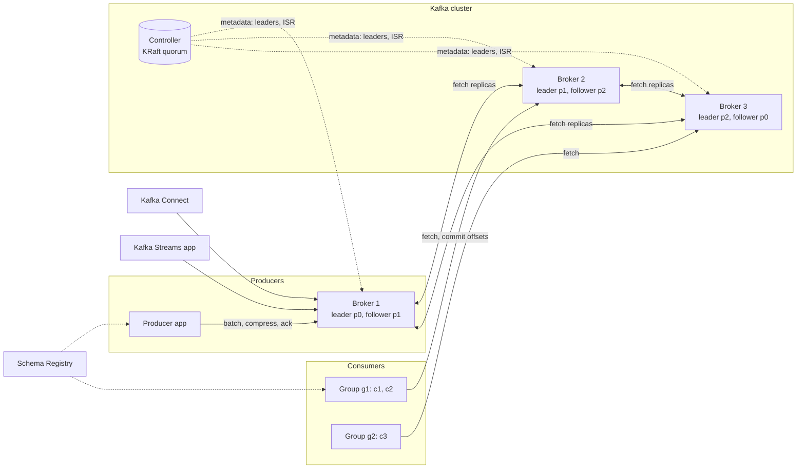

# Apache Kafka

> Concept / interview file. Implementation pair: [1.kafka1.md](1.kafka1.md). Rules: [.agents/rules.md](../../.agents/rules.md).

## Index
- [1. Concept](#1-concept)
  - [1.1 Why it was created](#11-why-it-was-created)
  - [1.2 Common use cases](#12-common-use-cases)
  - [1.3 Core mechanism in one picture](#13-core-mechanism-in-one-picture)
- [2. Architecture](#2-architecture)
- [3. Each component](#3-each-component)
  - [3.1 Topic, partition, log segment](#31-topic-partition-log-segment)
  - [3.2 Producer](#32-producer)
  - [3.3 Consumer and consumer group](#33-consumer-and-consumer-group)
  - [3.4 Offsets and commits](#34-offsets-and-commits)
  - [3.5 Replication, ISR, leader election](#35-replication-isr-leader-election)
  - [3.6 Delivery semantics: idempotence and transactions](#36-delivery-semantics-idempotence-and-transactions)
  - [3.7 Ordering and partitioning](#37-ordering-and-partitioning)
  - [3.8 Retention, compaction, tiered storage](#38-retention-compaction-tiered-storage)
  - [3.9 Controller: ZooKeeper vs KRaft](#39-controller-zookeeper-vs-kraft)
  - [3.10 Kafka Streams and ksqlDB](#310-kafka-streams-and-ksqldb)
  - [3.11 Kafka Connect and Schema Registry](#311-kafka-connect-and-schema-registry)
  - [3.12 Security and multi-tenancy](#312-security-and-multi-tenancy)
- [4. Adapting it](#4-adapting-it)
  - [4.1 Knobs and deciding variables](#41-knobs-and-deciding-variables)
  - [4.2 Tricks](#42-tricks)
  - [4.3 Best practices](#43-best-practices)
  - [4.4 Trade-off table](#44-trade-off-table)
  - [4.5 Patterns built on Kafka](#45-patterns-built-on-kafka)
- [5. Comparison](#5-comparison)
- [6. Failure modes](#6-failure-modes)
- [7. Interview questions](#7-interview-questions)
  - [7.1 Architecture and log (Q1–Q8)](#71-architecture-and-log-q1q8)
  - [7.2 Producer (Q9–Q14)](#72-producer-q9q14)
  - [7.3 Consumer and groups (Q15–Q22)](#73-consumer-and-groups-q15q22)
  - [7.4 Delivery guarantees (Q23–Q28)](#74-delivery-guarantees-q23q28)
  - [7.5 Replication and durability (Q29–Q33)](#75-replication-and-durability-q29q33)
  - [7.6 Ordering, retention, streams (Q34–Q40)](#76-ordering-retention-streams-q34q40)
  - [7.7 L5-only questions](#77-l5-only-questions)
- [8. Further thinking](#8-further-thinking)
- [References](#references)

---

## 1. Concept

### 1.1 Why it was created
- Pain before (LinkedIn, ~2010)
  - N producers × M consumers of activity data → N×M point-to-point pipes
  - traditional brokers (ActiveMQ, RabbitMQ) kept per-consumer delivery state in the broker
    - each consumer = broker-side bookkeeping, acks per message, message deleted after ack
    - replay impossible; adding a consumer meant re-publishing
    - throughput capped by per-message broker state, not by disk
  - batch ETL (Hadoop) was hours late; real-time needed a different substrate
- Prior art that failed
  - JMS/AMQP brokers: rich routing, but "smart broker / dumb consumer" → broker is the bottleneck
  - log shipping / Scribe / Flume: one-directional, no durable fan-out, no ordering across restarts
- Kafka's bet
  - **the log is the data structure**: append-only, sequential disk I/O, consumers own their position
  - "dumb broker / smart consumer": broker stores bytes, consumer tracks an integer (offset)
  - 🗣 "Kafka moved delivery state from the broker's heap into a single integer the consumer owns."

### 1.2 Common use cases
| Use case | Why Kafka fits | Where it shows up |
| --- | --- | --- |
| Event backbone / pub-sub between services | durable fan-out, replay, decoupled consumers | order events → billing, shipping, analytics |
| Change data capture (CDC) | ordered per key, compaction keeps latest | Debezium → search index, cache invalidation |
| Log / metrics aggregation | high write throughput, batched sequential disk | app logs → Elasticsearch / S3 |
| Stream processing input/output | exactly-once with transactions, partitioned parallelism | Kafka Streams, Flink, Spark |
| Event sourcing / audit | immutable ordered history | ledger, audit trail |
| Buffer in front of slow sinks | backpressure absorber | write spikes → DB, ML feature pipeline |
| ML / LLM platforms | feature events, inference request logs, training data replay | feature store ingest, online-offline consistency |

### 1.3 Core mechanism in one picture
```
producer ──(key → hash → partition)──▶ [topic T]
                                       ├─ partition 0: [0][1][2][3][4] ... ──▶ consumer A (group g1)
                                       ├─ partition 1: [0][1][2][3]    ... ──▶ consumer B (group g1)
                                       └─ partition 2: [0][1][2]       ... ──▶ consumer A (group g1)
                                             ▲                                        │
                                             │ append-only segments on disk           └─ commits offset {T,p → n} to __consumer_offsets
                                             └─ replicated to followers; ISR quorum decides "committed"
```
- Three things to internalize
  - a partition is a totally ordered, immutable sequence with a monotonically increasing offset
  - the broker never tracks "delivered"; the consumer group stores one offset per partition
  - durability = replication to an in-sync set, not fsync per message

---

## 2. Architecture



| Component | Single responsibility | Owned state |
| --- | --- | --- |
| Broker | store partitions, serve fetch/produce, replicate | log segments, indexes, ISR view of its leader partitions |
| Controller | cluster metadata, leader election, partition assignment | metadata log (`__cluster_metadata` in KRaft) |
| Producer client | batch, partition, retry, idempotence, transactions | record accumulator, PID + sequence numbers |
| Consumer client | fetch, deserialize, position tracking, group membership | fetch buffer, in-memory positions, heartbeat thread |
| Group coordinator (a broker role) | membership, rebalance, offset storage | `__consumer_offsets` partitions it leads |
| Transaction coordinator (a broker role) | transactional state machine | `__transaction_state` |
| Schema Registry (Confluent / Apicurio, not core) | schema ids, compatibility checks | schemas topic |
| Kafka Connect | source/sink connectors framework | offsets/config/status topics |
| Kafka Streams | client-side stream processing library | local RocksDB state + changelog topics |

---

## 3. Each component

### 3.1 Topic, partition, log segment
- Why created
  - need ordering + parallelism at once → total order inside a partition, parallelism across partitions
  - need bounded, deletable disk usage → log is split into **segments** so retention deletes whole files
- Common use cases
  - partition count = max consumer parallelism per group; key choice = ordering domain
- How it helps (mechanism)
  - on disk: `topic-partition/` dir → `00000000000000000000.log`, `.index` (offset → byte position, sparse), `.timeindex` (timestamp → offset)
  - append = sequential write to active segment; page cache absorbs it; fsync is **not** per message (`log.flush.interval.messages` default = max long; durability comes from replication)
  - read = binary search sparse index → seek → `sendfile()` zero-copy from page cache to socket (only when no re-compression / no TLS in older versions; TLS forces user-space copy)
  - **record batch** is the unit of storage, compression, and CRC; producer builds it, broker stores it as-is (unless `compression.type` on topic differs → recompress)
  - cost: partition = open file handles, index memory, replication fetchers, controller metadata; per-broker practical ceiling order of magnitude ~4k partitions (ZK era guidance), higher with KRaft
- How engineers adapt
  - `num.partitions`: deciding variable = target throughput ÷ per-partition consumer throughput, rounded up, plus headroom (can only grow, growth breaks key→partition mapping)
  - `segment.bytes` (default 1 GiB) / `segment.ms` (7 d): smaller → finer retention granularity, more files
  - `retention.ms` / `retention.bytes`: per topic, deciding variable = replay window needed by slowest consumer + incident recovery
- Tricks
  - over-partition modestly (e.g. 2–3× current need) because repartitioning later reshuffles keys
  - use `log.dirs` across multiple disks (JBOD) for I/O parallelism; RAID-10 trades capacity for simpler failure
- Best practices
  - rule: never let a single topic hold thousands of partitions on a small cluster → prevents controller/rebalance storms
  - rule: set topic-level retention explicitly → prevents surprise 7-day default deleting audit data
- Limits
  - no per-message TTL, no priority, no selective delete (only compaction tombstones)
  - partition count is effectively a one-way door for keyed topics

### 3.2 Producer
- Why created: raw socket writes would be one round trip per message; batching + async pipeline is where Kafka throughput comes from
- Mechanism (client side)
  ```
  send(record) → serializer → partitioner → RecordAccumulator (per-partition deque of batches)
        → Sender thread: drain ready batches → group by leader broker → ProduceRequest (up to max.in.flight per connection)
        → broker ack → Future / callback
  ```
  - batch is "ready" when `batch.size` full OR `linger.ms` elapsed OR another batch to same broker is ready
  - `buffer.memory` full → `send()` blocks up to `max.block.ms` then throws — this is the producer's backpressure
  - `acks`
    - `0`: fire-and-forget; loss on any failure
    - `1`: leader wrote to its log (page cache, not fsync); loss if leader dies before followers fetch
    - `all` (-1): leader waits until all **ISR** replicas have it; combined with `min.insync.replicas` this is the durability guarantee (§3.5)
  - retries: `retries` (default MAX_INT since 2.1) bounded by `delivery.timeout.ms` (default 120 s); retriable vs non-retriable (`RecordTooLargeException` never retried)
  - idempotence (`enable.idempotence=true`, default since 3.0): broker assigns PID; each batch carries (PID, epoch, sequence); broker dedups on retry per partition, keeps last 5 sequences → allows `max.in.flight.requests.per.connection` ≤ 5 **with** ordering
- Knobs / deciding variable
  | Knob | Default | Deciding variable |
  | --- | --- | --- |
  | `acks` | all (3.0+) | can you tolerate loss vs need lowest latency |
  | `linger.ms` / `batch.size` | 0 / 16 KiB | throughput per broker connection vs p99 latency |
  | `compression.type` | none | network + disk cost vs CPU; `lz4`/`zstd` usually win |
  | `max.in.flight.requests.per.connection` | 5 | ordering with idempotence (≤5) vs pipelining depth |
  | `delivery.timeout.ms` | 120 s | how long a stuck partition may block before you learn about it |
  | `partitioner.class` | sticky (2.4+) | keyless: sticky fills batches; keyed: hash |
- Tricks
  - `linger.ms=5–20` with `batch.size=64–256 KiB` and `zstd` → order-of-magnitude fewer requests at the cost of ms latency
  - large messages: claim-check pattern (store blob in S3, send pointer) instead of raising `max.request.size`
- Best practices
  - rule: always handle the callback / future exception → prevents silent loss on non-retriable errors
  - rule: `acks=all` + `min.insync.replicas=2` + `replication.factor=3` → prevents "acked but lost" on single-broker failure
- Limits: producer cannot address a partition on a follower; cannot wait for "all replicas" beyond ISR; no per-message priority

### 3.3 Consumer and consumer group
- Why created: N consumers must share partitions without the broker tracking delivery; group protocol makes membership and assignment a client-driven agreement
- Mechanism
  - `poll()` is single-threaded and does everything: fetch, heartbeat scheduling (separate thread since 0.10.1), rebalance participation, offset commit (if auto)
  - fetch: `fetch.min.bytes` / `fetch.max.wait.ms` long-poll; `max.partition.fetch.bytes`; `max.poll.records` bounds returned records
  - liveness = two timers
    - `session.timeout.ms` (45 s default in 3.0+): heartbeat thread missed → kicked
    - `max.poll.interval.ms` (5 min): app thread did not call `poll()` → consumer leaves group (processing too slow / stuck)
  - group protocol
    - find **group coordinator** (hash(group.id) % offsets partitions → its leader broker)
    - JoinGroup → coordinator picks a group leader (a consumer) → leader runs assignor → SyncGroup distributes assignment
    - assignors: `RangeAssignor` (default, per-topic ranges → skew), `RoundRobin`, `StickyAssignor`, `CooperativeStickyAssignor` (incremental rebalance, 2.4+)
    - eager rebalance: everyone revokes everything → stop-the-world; cooperative: only moved partitions revoked, two rounds
    - `group.instance.id` (static membership): a restart within `session.timeout.ms` does not trigger rebalance
    - KIP-848 (3.7+ new consumer protocol): broker-side assignment, no JoinGroup/SyncGroup barrier, server-driven incremental
  - `auto.offset.reset` (`latest` default): only applies when no committed offset exists or offset out of range
- Knobs
  | Knob | Deciding variable |
  | --- | --- |
  | `max.poll.records` × per-record time < `max.poll.interval.ms` | processing cost per record |
  | `partition.assignment.strategy` | tolerance for stop-the-world vs needing 2.4+ clients |
  | `group.instance.id` | stateful consumers (Streams) or slow-restart pods |
  | `fetch.min.bytes` / `fetch.max.wait.ms` | latency vs broker request rate |
  | `isolation.level` | `read_committed` when upstream uses transactions |
- Tricks
  - decouple poll loop from processing: worker pool + `pause()`/`resume()` + commit only processed offsets
  - many idle consumers > partitions is wasted: consumers beyond partition count sit idle
- Best practices
  - rule: commit after processing, not before → prevents loss on crash mid-batch
  - rule: use cooperative-sticky or KIP-848 → prevents full-group pauses on every deploy
- Limits: one partition ↔ at most one consumer per group; per-partition throughput bounds a single consumer; no broker-side filtering (client reads everything)

### 3.4 Offsets and commits
- Mechanism
  - committed offset = **next offset to read**, stored as a compacted record `{group, topic, partition} → offset` in `__consumer_offsets` (50 partitions default, `offsets.topic.replication.factor=3`)
  - auto commit (`enable.auto.commit=true`, every 5 s) commits what the last `poll()` returned → at-most-once-ish under crash (already-returned but unprocessed records get committed)
  - `commitSync` (blocking, retries), `commitAsync` (no retry, callback; order of callbacks can invert → use sync on close)
  - offset commit is per partition; you may commit a subset (`commitSync(Map)`)
  - retention of committed offsets: `offsets.retention.minutes` (7 d) after group becomes empty → then `auto.offset.reset` applies
- Semantics
  | Commit strategy | Guarantee | Failure it risks |
  | --- | --- | --- |
  | commit before processing | at-most-once | loss on crash |
  | commit after processing | at-least-once | duplicate on crash → needs idempotent handler |
  | commit atomically with side effect (same DB tx, or Kafka tx) | effectively-once | requires sink participation |
- Tricks
  - store offsets in the sink DB (same transaction as the effect); on start `seek()` to DB offset → exactly-once to a DB without Kafka transactions
  - `kafka-consumer-groups --reset-offsets --to-datetime` for replay windows

### 3.5 Replication, ISR, leader election
- Why created: durability without fsync-per-message, and availability across broker loss
- Mechanism
  - each partition: one **leader**, N-1 **followers** that fetch from leader like consumers (pull, not push)
  - **ISR** = replicas within `replica.lag.time.max.ms` (30 s) of the leader's log end offset (LEO)
  - **high watermark (HW)** = min(LEO of ISR); consumers see only ≤ HW; a message is "committed" when all ISR have it
  - `acks=all` ack is sent when HW advances past the batch → needs `min.insync.replicas` replicas in ISR else `NotEnoughReplicasException`
  - leader failure: controller picks a new leader from ISR (`unclean.leader.election.enable=false` default) → no committed data loss; if ISR empty and unclean enabled → availability over consistency, truncation
  - followers truncate to leader's HW on becoming follower; **leader epoch** (KIP-101) prevents divergence when two leaders' logs overlap
  - `replica.fetch.*` controls follower throughput; followers are also readers → fetch-from-follower (KIP-392, `replica.selector.class`) lets rack-local consumers read followers
- Deciding variables
  | Knob | Deciding variable |
  | --- | --- |
  | `replication.factor` (3) | tolerate f=1 broker loss while still having 2 for `min.isr` |
  | `min.insync.replicas` (1 → set 2) | how many copies before "acked"; 2 with RF=3 tolerates one down broker |
  | `unclean.leader.election.enable` (false) | is availability worth losing acked data (logs/metrics: maybe yes) |
  | `replica.lag.time.max.ms` | how far behind a replica can be before it is not counted for durability |
- 🗣 "acks=all means all in-sync replicas — if the ISR has shrunk to 1, acks=all is acks=1 unless min.insync.replicas stops it."
- Limits: cross-datacenter sync replication adds RTT to every ack; stretch clusters need rack awareness (`broker.rack`) and observers are not native (MirrorMaker 2 / Cluster Linking for async)

### 3.6 Delivery semantics: idempotence and transactions
- Why created: retries create duplicates at the producer; read-process-write pipelines (Streams) needed atomic "consume + produce + commit"
- Mechanism
  - idempotent producer (§3.2): dedups producer retries only; does not dedup across producer restarts (new PID) or application-level resends
  - transactions (KIP-98, 0.11)
    - `transactional.id` → coordinator assigns PID + **epoch**; a new producer with the same id bumps epoch → old one is **fenced** (zombie protection)
    - flow: `initTransactions` → `beginTransaction` → `send` (to many partitions) → `sendOffsetsToTransaction(group)` → `commitTransaction`
    - coordinator writes PREPARE to `__transaction_state`, then writes **control records** (COMMIT/ABORT markers) into every partition touched, then COMPLETE
    - consumers with `isolation.level=read_committed` hold back records past the **last stable offset (LSO)** until markers arrive → aborted records skipped
    - Streams `processing.guarantee=exactly_once_v2` (KIP-447, 2.5+): one producer per thread instead of per input partition; fencing via group epoch
  - cost: extra round trips per commit (`commit.interval.ms` batching), LSO lag increases end-to-end latency, read_committed consumers stall if a transaction hangs (`transaction.max.timeout.ms`)
- Boundaries
  - exactly-once holds **Kafka → Kafka** only; any external sink (DB, HTTP, S3) needs its own idempotency (key, upsert, dedup table) or an outbox
  - 🗣 "Kafka gives exactly-once between topics; to a database it gives at-least-once plus your idempotency key."
- Limits: transactions do not span clusters; long transactions block read_committed consumers; not a substitute for consumer-side idempotency toward external systems

### 3.7 Ordering and partitioning
- Guarantee: order **per partition** for a single producer with `max.in.flight ≤ 5` and idempotence on (or `=1` without); no cross-partition, no cross-producer order
- Partitioner
  - keyed: `murmur2(key) % numPartitions` (Java default; librdkafka uses `crc32` unless configured `murmur2_random` → mixed-language producers must align!)
  - keyless: sticky partitioner fills one batch then moves (2.4+); `UniformStickyPartitioner`
  - custom: route by tenant, or key-hash into a fixed virtual-bucket space to allow future partition growth
- Skew: hot keys → hot partitions; mitigations: salt key (key#0..k, lose per-key order), sub-key, or move hot key to its own topic
- Changing partition count re-maps keys → in-flight per-key ordering breaks; keyed topics: size once, or use bucket indirection

### 3.8 Retention, compaction, tiered storage
- Delete retention: whole segments deleted when older than `retention.ms` or size > `retention.bytes` (active segment never deleted → effective retention ≥ segment roll)
- Compaction (`cleanup.policy=compact`)
  - background cleaner keeps the **latest value per key**; tombstone (null value) deletes after `delete.retention.ms` (24 h)
  - only "clean" up to the **dirty ratio** (`min.cleanable.dirty.ratio` 0.5); head of log is never compacted (`min.compaction.lag.ms`)
  - use: changelog / CDC / state snapshots; consumers rebuilding state read whole compacted topic
  - defeater: compaction ≠ dedup within a window; recent duplicates remain until cleaner runs
- Tiered storage (KIP-405, GA 3.9): older segments offloaded to object store; broker keeps local hot set → cheaper long retention, but remote fetch latency is object-store latency
- `cleanup.policy=compact,delete` both

### 3.9 Controller: ZooKeeper vs KRaft
| Aspect | ZooKeeper mode (≤3.x, removed in 4.0) | KRaft (production 3.3+, only mode in 4.0) |
| --- | --- | --- |
| Metadata store | ZK znodes; controller broker watches | `__cluster_metadata` Raft-replicated log on controller quorum |
| Controller failover | ZK ephemeral node; new controller reloads all metadata from ZK (seconds–minutes at scale) | standby controllers already have the log in memory → sub-second |
| Partition ceiling | order of magnitude ~200k per cluster | millions (metadata is a log, brokers fetch deltas) |
| Ops | two systems to secure, upgrade | one binary; controllers can be co-located (small) or dedicated (prod) |
- Mechanism: brokers fetch metadata deltas from active controller; broker registration + heartbeat via controller; fencing by broker epoch

### 3.10 Kafka Streams and ksqlDB
- Why: stateful processing (joins, windows, aggregates) needed local state + fault tolerance without a separate cluster (vs Flink/Spark)
- Mechanism
  - library in your JVM app; parallelism = input partitions; **task** = one partition group; threads run tasks
  - state: local RocksDB per task + **changelog topic** (compacted) → on failover another instance restores from changelog; standby replicas (`num.standby.replicas`) cut restore time
  - repartition topics inserted automatically when you `groupBy`/`join` on a non-key (co-partitioning requirement: same partition count + same partitioner for joins)
  - KStream (event) vs KTable (changelog/upsert) vs GlobalKTable (full copy on every instance, for small dimension joins)
  - windows: tumbling, hopping, sliding, session; **grace period** for late events; suppress for final results
  - exactly-once via transactions (§3.6)
- ksqlDB: SQL over Streams, own server; good for filters/aggregates; weak for arbitrary code
- Limits: only Kafka in/out; JVM only; rebalances move state; not a general DAG scheduler

### 3.11 Kafka Connect and Schema Registry
- Connect: worker cluster runs source (DB → Kafka, e.g. Debezium CDC) and sink (Kafka → S3/Elastic/JDBC) connectors; tasks scale by partition; offsets in `connect-offsets`; SMTs transform per record; sink DLQ via `errors.deadletterqueue.topic.name`
- Schema Registry: producer registers schema → gets id → wire format `[magic 0][4-byte id][payload]`; consumer fetches by id; compatibility modes (BACKWARD default: new schema can read old data; consumers upgrade first) → prevents "poison" incompatible payloads; formats Avro / Protobuf / JSON Schema

### 3.12 Security and multi-tenancy
- Encryption: TLS listeners (disables zero-copy sendfile → CPU cost)
- Auth: SASL (PLAIN, SCRAM, GSSAPI, OAUTHBEARER), mTLS
- AuthZ: ACLs per principal × resource (topic, group, transactional id); `StandardAuthorizer` in KRaft
- Quotas: produce/fetch byte-rate and request-rate per client-id/user → protect tenants from each other (throttle by delaying responses)

---

## 4. Adapting it

### 4.1 Knobs and deciding variables
| Goal | Knob set | Deciding variable |
| --- | --- | --- |
| No acked loss | `acks=all`, `min.insync.replicas=2`, RF=3, `unclean.leader.election=false` | cost of one lost message |
| Throughput | `linger.ms`, `batch.size`, `compression.type=zstd/lz4`, more partitions | MB/s per broker, CPU headroom |
| Low latency | `linger.ms=0`, `fetch.max.wait.ms` low, fewer hops (no transactions) | p99 target |
| Ordering per key | key choice, idempotence, `max.in.flight ≤ 5`, fixed partition count | ordering domain size |
| Consumer stability | `max.poll.interval.ms`, `max.poll.records`, cooperative assignor, static membership | per-record processing time, deploy frequency |
| Storage cost | `retention.*`, compaction, tiered storage | replay window, key cardinality |
| Cluster scale | partitions per broker, KRaft, dedicated controllers | total partitions, metadata churn |

### 4.2 Tricks
- **Key-bucket indirection**: key → `hash % 1024` virtual bucket → bucket → partition; lets you grow partitions later without breaking key affinity
- **Retry topics with delays** (`retry-1s`, `retry-30s`, `retry-5m`) + DLT instead of blocking the partition (non-blocking retries; Spring Kafka `@RetryableTopic`)
- **Pause/resume backpressure**: `pause(partitions)` while worker queue is full; `poll()` keeps heartbeating without returning records
- **Transactional outbox**: write event to `outbox` table in the same DB transaction as the business row; a relay (Debezium or poller) publishes → no dual-write loss
- **Fetch from follower** for cross-AZ cost (`client.rack`)
- **Compacted topic as a KV snapshot**: bootstrap caches by reading a compacted topic from offset 0
- **Header-based routing/versioning**: put schema version / trace id in record headers, not payload
- **Consumer lag as SLO**: alert on lag in *seconds* (`kafka_consumergroup_lag` × produce rate) not messages

### 4.3 Best practices
| Rule | Failure it prevents |
| --- | --- |
| Always set a key when order matters, and never change partition count on that topic | interleaved updates per entity after resize |
| Make consumers idempotent (idempotency key or upsert) | duplicates from at-least-once redelivery |
| Commit only after side effects are durable | loss on crash between commit and effect |
| Bound processing per poll (`max.poll.records`) and time work | `max.poll.interval` expiry → rebalance loop |
| Separate poison-pill handling (DLT after N tries) | one bad record halts a partition forever |
| Use Schema Registry with BACKWARD compatibility and upgrade consumers first | deserialization failures → stuck consumers |
| Monitor `UnderReplicatedPartitions`, ISR shrink/expand, request queue time, consumer lag | silent durability downgrade |
| Rack-aware replica placement (`broker.rack`) | AZ loss takes all replicas |
| Set `delivery.timeout.ms` and handle producer errors | unbounded blocking or silent drops |
| Size `num.partitions` from throughput ÷ per-consumer throughput, ×2 headroom | cannot scale consumers later |

### 4.4 Trade-off table
| Option | Buys you | Costs you | Choose when |
| --- | --- | --- | --- |
| `acks=1` | lowest ack latency | loss on leader crash before replication | metrics/logs where loss is tolerable |
| `acks=all` + min.isr=2 | no acked loss with one broker down | +1 replica RTT, unavailable if 2 brokers down | money, orders, anything replayed downstream |
| Idempotent producer only | no retry duplicates, ordering with pipelining | nothing material (default) | always |
| Transactions | atomic multi-partition write + offset commit | latency, LSO stall, complexity | Kafka→Kafka pipelines, Streams EOS |
| Compaction | latest-state topic, bounded size by key cardinality | loses history, cleaner I/O | CDC, state changelogs, config |
| Cooperative rebalance | no stop-the-world on membership change | needs 2.4+ clients, two-phase | any group with frequent deploys |
| Static membership | no rebalance on restart | zombie partition idle until session timeout | Streams, slow-boot pods |
| Many partitions | more consumer parallelism | controller load, more open files, longer failover | high throughput or many consumers |

### 4.5 Patterns built on Kafka
```
Outbox:      [DB tx: business row + outbox row] → relay/CDC → Kafka → consumers
Saga:        order-svc → topic → payment-svc → topic → shipping-svc; compensations on failure events
CQRS:        commands → Kafka → projections (read models) via consumers
Retry/DLT:   main → (fail) retry-1 → retry-2 → DLT; each with its own consumer + delay
Claim check: blob → S3; Kafka carries pointer + metadata
Fan-out:     one topic, many groups (each group = independent cursor)
Compete:     one topic, one group, many consumers (each partition to one consumer)
```

---

## 5. Comparison

| Option | What it is | Strength | Weakness | Choose when |
| --- | --- | --- | --- | --- |
| **Apache Kafka** | partitioned replicated log, pull consumers, client-side groups | replay, ordering per key, throughput (order of magnitude 100s MB/s per broker), ecosystem (Streams/Connect) | ops burden (cluster, partitions, rebalances), no per-message TTL/priority, consumer complexity | event backbone, CDC, stream processing, multi-consumer replay |
| **Apache Pulsar** | log + separate storage (BookKeeper), segment-centric, broker stateless | tiered storage native, multi-tenancy, geo-replication, both queue + stream semantics, millions of topics | two systems (brokers + bookies + ZK), smaller ecosystem, more moving parts | many tenants/topics, need queue *and* stream in one system |
| **RabbitMQ** | AMQP broker: exchanges → queues, push delivery, per-message ack | routing flexibility, per-message TTL/priority, low latency small scale, easy | broker tracks delivery state → throughput ceiling, no replay after ack (streams plugin partially), quorum queues cost | task queues, RPC-style work distribution, complex routing, modest scale |
| **AWS SQS (+SNS)** | managed queue (standard: at-least-once unordered; FIFO: ordered per group, 300–3000 msg/s per group) | zero ops, per-message visibility timeout, DLQ built in | no replay, no fan-out itself (SNS), FIFO throughput caps, 256 KB max | AWS-native services, simple work queues, no replay needed |
| **Amazon Kinesis Data Streams** | managed shard log | Kafka-like ordered shards, AWS integration | 1 MB/s in · 2 MB/s out per shard, 7-day max (365 extended), shard resharding manual | AWS, moderate throughput streaming |
| **Google Pub/Sub** | managed global pub-sub | no capacity planning, global, exactly-once delivery option, ordering keys | no true replay beyond retention/seek (7 d default), ordering only per key within region, cost at scale | GCP-native, bursty, global |
| **Redis Streams** | in-memory log with consumer groups | very low latency, simple, already have Redis | memory-bound, durability weaker (AOF), no partitioning built in | small event logs, caching tier already Redis |
| **NATS JetStream** | lightweight log/queue | tiny footprint, simple ops, edge/IoT | smaller ecosystem, less battle-tested at Kafka scale | edge, microservices control plane |

- Pick
  - deciding variable = **do you need replay + multiple independent consumers over the same ordered history?**
    - yes → Kafka (default), Pulsar if multi-tenant/many-topic or you want built-in tiering and queue semantics
    - no, just distribute work → SQS (AWS) / RabbitMQ (routing, priority, TTL)
  - second variable = ops budget: managed (MSK, Confluent Cloud, Kinesis, Pub/Sub) unless you have a platform team
  - 🗣 "Queue when a message is a task to be consumed once; log when a message is a fact that many readers may need again."

---

## 6. Failure modes

| Failure | Trigger | Detection | Mitigation |
| --- | --- | --- | --- |
| Acked message lost | `acks=1` or ISR shrank to 1 with `min.isr=1`, leader dies | `UnderReplicatedPartitions`, ISR shrink metric, data gaps downstream | `acks=all`, `min.isr=2`, alert on ISR shrink |
| Unclean leader election data loss | ISR empty + `unclean.leader.election.enable=true` | log truncation warnings, offset out of range on consumers | keep false; accept unavailability, fix replicas |
| Rebalance storm | consumer exceeds `max.poll.interval.ms`, flapping pods, eager assignor | frequent `JoinGroup`, lag sawtooth, `rebalance-rate` | cooperative-sticky / KIP-848, static membership, bound per-poll work |
| Stuck partition (poison pill) | deserialization/processing exception on one record with blocking retry | lag on one partition only, error logs repeating same offset | DLT after N attempts, schema registry, skip + alert |
| Consumer lag runaway | consumer throughput < produce rate, hot partition | lag in seconds growing, `records-lag-max` | add partitions/consumers, fix key skew, batch writes to sink |
| Duplicate processing | at-least-once redelivery after crash, producer retry without idempotence | duplicate rows / double charges | idempotent consumers, idempotent producer, tx outbox |
| Hot partition | skewed key (one tenant), keyless sticky partitioner with tiny batches | per-partition bytes-in imbalance, one broker CPU high | salt key, sub-key, dedicated topic, review partitioner |
| Broker disk full | retention too long, compaction stalled, tiered storage disabled | `log-dir` free bytes, broker shutdown | retention/tiering, quotas, add disk |
| Controller failover slow (ZK) | controller crash at high partition count | metadata unavailable, leader election delays | migrate to KRaft, fewer partitions per cluster |
| Transaction hang → read_committed stall | producer died mid-tx, long `transaction.timeout.ms` | LSO not advancing, consumers stuck though HW moves | lower tx timeout, coordinator aborts, alert on LSO lag |
| Schema incompatibility | producer deployed new schema before consumers | deserialization exceptions, DLT fills | registry compatibility = BACKWARD, consumers first |
| Zombie producer writes | old instance keeps producing after failover | duplicate/out-of-order events | transactional.id fencing (epoch), or leases at app layer |
| Cross-AZ cost/latency | replicas + consumers in different AZs | cloud egress bill, tail latency | rack awareness, fetch-from-follower |
| Clock-skewed timestamps | producer sets `CreateTime` from bad clock | window aggregates wrong, retention early/late | `LogAppendTime` for retention, event-time with grace in Streams |

---

## 7. Interview questions

### 7.1 Architecture and log (Q1–Q8)

**Q1:** What is Kafka and how does it differ from a traditional message broker?

**L4 answer**
- distributed, partitioned, replicated append-only log
- producers append; consumers pull and track their own offset; broker keeps no per-consumer delivery state
- traditional brokers (RabbitMQ/JMS) push, ack per message, delete after consumption; Kafka retains by time/size so many groups can read the same data and replay

**L5 answer**
- L4 plus:
  - mechanism: sequential disk writes into segments + page cache + zero-copy sendfile → throughput bounded by disk/network, not by broker CPU tracking acks
  - trade-off: broker simplicity moved complexity into clients (batching, groups, offsets) → clients are harder, and semantics like priority/TTL per message are absent
  - at scale: partition count becomes the metadata bottleneck (ZK era) → KRaft; consumer group protocol becomes the availability bottleneck → cooperative/KIP-848
  - context: for a task queue with per-job ack/retry/priority I would pick SQS/RabbitMQ; Kafka when many consumers need the same ordered history

**Q2:** Explain topics, partitions, offsets, and segments.

**L4 answer**
- topic = logical stream; partition = ordered, immutable shard with offsets 0..n; offset = position, unique within a partition only
- segment = on-disk file chunk of a partition (`.log`, `.index`, `.timeindex`); retention deletes whole segments

**L5 answer**
- L4 plus:
  - sparse offset index (entry every `index.interval.bytes`, 4 KiB) → O(log n) seek, tiny memory; time index maps timestamp → offset for `offsetsForTimes`
  - batch is the storage unit: CRC, compression, sequence numbers apply per batch → broker validates without decompressing (unless recompression)
  - why segments: deletion = unlink file (O(1)), compaction rewrites closed segments only; active segment never deleted → effective retention ≥ `segment.ms`
  - context: for an audit topic I set `segment.ms` small so retention boundary is tight, and use tiered storage for years of history

**Q3:** How does Kafka achieve high throughput?

**L4 answer**
- producer batching + compression; sequential I/O; page cache; zero-copy transfer; partitions for parallelism; pull consumers batch fetches

**L5 answer**
- L4 plus:
  - mechanism: `RecordAccumulator` amortizes one request over many records; broker appends batch bytes verbatim (no per-record parsing); `sendfile()` avoids user-space copy; followers fetch in large batches too
  - cost: batching adds `linger.ms` latency; page cache means durability comes from replication not fsync → tied to `acks`/ISR correctness
  - at scale: TLS disables zero-copy; recompression on topic mismatch burns CPU; too many partitions → many small batches → throughput drops (batching per partition)
  - 🗣 "Kafka is fast because the broker does as little per message as possible — it moves bytes, not messages."

**Q4:** What does the controller do, and what changed with KRaft?

**L4 answer**
- controller: one broker (ZK) or a Raft quorum (KRaft) that owns metadata — partition leaders, ISR, broker liveness, topic config — and elects leaders on failure
- KRaft removes ZooKeeper; metadata is a replicated log; faster failover; ZK removed in Kafka 4.0

**L5 answer**
- L4 plus:
  - mechanism: `__cluster_metadata` Raft log; brokers fetch deltas and apply; standby controllers already hot → failover order of magnitude ms vs ZK reload of all znodes
  - trade-off: controllers in separate JVMs (recommended prod) = more nodes; combined mode for small clusters
  - scale: partition ceiling moves from ~200k to millions (Confluent KIP-500 tests, order of magnitude); broker registration + fencing via epochs replaces ephemeral znodes
  - context: migration path 3.4+ with dual-write; I'd do it before 4.0 forced upgrade

**Q5:** How does a consumer read data — walk through a fetch.

**L4 answer**
- consumer sends FetchRequest to the partition leader with offset; broker waits up to `fetch.max.wait.ms` for `fetch.min.bytes`; returns batches up to `max.partition.fetch.bytes`; consumer deserializes; `poll()` returns ≤ `max.poll.records`

**L5 answer**
- L4 plus:
  - broker looks up offset via sparse index → sends bytes from page cache; only up to HW (or LSO under read_committed)
  - fetch sessions (KIP-227) keep incremental partition state per session to shrink request size for consumers with many partitions
  - pre-fetching: consumer pipelines next fetch while app processes → `max.poll.records` bounds memory and time per poll
  - fetch-from-follower for rack locality; cost is staleness up to replica lag

**Q6:** How many partitions should a topic have?

**L4 answer**
- ≥ max consumers you need in one group; based on throughput ÷ per-consumer capacity; more partitions = more parallelism but more overhead; hard to reduce later

**L5 answer**
- L4 plus:
  - formula: `max(target_MB/s ÷ producer_per_partition, target_MB/s ÷ consumer_per_partition)` × headroom; keyed topics: decide once because hash → partition mapping changes on growth
  - costs: per-partition replica fetchers, open files, leader election time, batch fragmentation on producer, more end-to-end latency (batches per partition smaller)
  - scale: prefer more topics with moderate partitions over one giant topic; KRaft raises ceiling but rebalance cost is client-side
  - context: use key-bucket indirection if growth is expected

**Q7:** What happens when a broker dies?

**L4 answer**
- controller detects (missed heartbeat / session), elects new leaders from ISR for its partitions, updates metadata; clients refresh metadata on `NotLeaderForPartition` and retry; under-replicated partitions until broker returns and catches up

**L5 answer**
- L4 plus:
  - leader epoch bump; followers truncate to leader's HW using epoch → prevents divergent logs (KIP-101)
  - unavailability window = detection (`broker.session.timeout.ms`) + election + client metadata refresh (`metadata.max.age.ms` or error-driven)
  - if the dead broker hosted the group coordinator, consumers must rediscover coordinator → brief commit failures
  - producers with `acks=all` see `NotEnoughReplicas` if min.isr can't be met → correct outcome; unclean election would trade this for loss
  - context: rack-aware placement so one AZ loss keeps min.isr satisfiable

**Q8:** What is the role of the page cache and does Kafka fsync?

**L4 answer**
- writes go to OS page cache; flush to disk is periodic (`log.flush.*` default off → OS decides); durability relies on replicas; fsync would cut throughput

**L5 answer**
- L4 plus:
  - a message is safe when replicated to `min.isr` brokers in different failure domains, not when on one disk; power loss of a single node is covered by other replicas; correlated loss (whole AZ power) is the defeater → rack awareness, RF across AZs
  - recovery: on unclean shutdown, broker rebuilds indexes and truncates to last valid batch (CRC) per segment → long restart with large logs (`num.recovery.threads.per.data.dir`)
  - trade-off: some deployments enable `log.flush.interval.messages` for regulatory reasons at large throughput cost

### 7.2 Producer (Q9–Q14)

**Q9:** Walk through what happens on `producer.send()`.

**L4 answer**
- serialize → choose partition (key hash or sticky) → append to per-partition batch in accumulator → sender thread groups ready batches per broker → ProduceRequest → broker appends → ack per `acks` → future completes / callback

**L5 answer**
- L4 plus:
  - metadata fetch on first send (blocks up to `max.block.ms`); `buffer.memory` exhaustion blocks `send` → the only producer backpressure
  - idempotence assigns sequence numbers per partition at batch creation; retries re-send with same sequence; broker dedups against last 5 batches per PID/partition
  - `delivery.timeout.ms` ≥ `linger.ms` + `request.timeout.ms` × retries bound; expiry surfaces as `TimeoutException` in callback
  - context: high-throughput ingestion → `linger.ms=10`, `batch.size=128KiB`, `zstd`; low-latency control events → `linger.ms=0`

**Q10:** `acks=0/1/all` — what does each guarantee?

**L4 answer**
- 0: no wait, may lose; 1: leader appended, may lose if leader fails before replication; all: all in-sync replicas appended, no loss as long as ISR ≥ min.isr

**L5 answer**
- L4 plus:
  - `all` waits for HW advance, so ack latency = slowest ISR replica fetch RTT; ISR is dynamic → `min.insync.replicas` is the real floor
  - with `min.isr=1`, `acks=all` degrades to `acks=1` silently when replicas fall behind → alert on ISR shrink
  - `acks=1` also breaks idempotence guarantees across leader change (KIP-1 semantics) → idempotence requires `acks=all`
  - context: logs/metrics topics `acks=1` for cost; anything with downstream money `acks=all`

**Q11:** What is the idempotent producer and what does it not solve?

**L4 answer**
- broker dedups producer retries via PID + sequence per partition; prevents duplicates and reordering from retries; default on
- does not dedup across producer restarts, application resends, or multi-partition atomicity

**L5 answer**
- L4 plus:
  - state: broker keeps last 5 sequence numbers per (PID, partition) in memory + snapshot; allows `max.in.flight=5` with order (`OutOfOrderSequence` triggers resend)
  - PID is not persistent across restarts → a restarted producer after a network-partition retry can still duplicate; transactional.id gives stable identity + fencing
  - cost is negligible → keep on; disabling to get `max.in.flight>5` is a false economy

**Q12:** How do you send a 50 MB message?

**L4 answer**
- don't; use claim-check (store in S3/GCS, send pointer); or raise `max.request.size`, `message.max.bytes`, `replica.fetch.max.bytes`, `max.partition.fetch.bytes` consistently; chunk with sequence numbers as last resort

**L5 answer**
- L4 plus: big messages break batching, page cache efficiency, replication lag (one message > replica fetch size stalls ISR), and consumer memory; mechanism-level reason why default is 1 MiB; chunking needs reassembly state and per-key ordering

**Q13:** How does the producer decide the partition for keyless messages, and why did it change?

**L4 answer**
- pre-2.4: round-robin per record → tiny batches; 2.4+: sticky partitioner fills a batch for one partition then switches → better batching, same long-run balance

**L5 answer**
- L4 plus: 3.3 (KIP-794) made stickiness adaptive to broker latency (`partitioner.adaptive.partitioning.enable`) to avoid piling onto slow brokers; skew risk when `linger.ms` is high and traffic low; Java murmur2 vs librdkafka crc32 mismatch when mixing clients on keyed topics

**Q14:** How do you handle producer backpressure and failures?

**L4 answer**
- `buffer.memory` full → blocking → surface as timeout; handle callback errors; retriable handled by client; non-retriable (size, auth, serialization) must be logged/DLQ'd; metrics `record-error-rate`, `buffer-available-bytes`

**L5 answer**
- L4 plus: partition-level stuck (leader down, min.isr unmet) blocks only that partition's batches but shared buffer eventually starves all → isolate critical topics with separate producers; `delivery.timeout.ms` sets max blast; for outbox relays use sync send + DB mark to keep exactly-once toward Kafka

### 7.3 Consumer and groups (Q15–Q22)

**Q15:** How do consumer groups work?

**L4 answer**
- consumers with same `group.id` share partitions; each partition to exactly one member; coordinator broker manages membership via heartbeats; assignment via join/sync; offsets committed per group in `__consumer_offsets`; different groups are independent

**L5 answer**
- L4 plus: coordinator = leader of `__consumer_offsets` partition for hash(group); assignment computed client-side by group leader (classic) or broker-side (KIP-848); rebalance is a barrier → generation id fences stale commits (`CommitFailedException`); consumers > partitions idle; scale: hundreds of members → long joins → static membership + cooperative

**Q16:** What triggers a rebalance and how do you minimize its impact?

**L4 answer**
- member join/leave/crash, `max.poll.interval` exceeded, subscription change, partition count change; minimize via cooperative-sticky assignor, static membership, tuned timeouts, bounded per-poll work

**L5 answer**
- L4 plus: eager protocol revokes all partitions (stop-the-world, commit offsets in `onPartitionsRevoked`); cooperative revokes only moved ones across two join rounds; KIP-848 removes the global barrier entirely; static membership makes a restart within session timeout invisible at the cost of idle partitions; scale: one slow consumer holding a rebalance hostage → set `max.poll.interval.ms` to real worst-case processing and prefer smaller `max.poll.records`

**Q17:** `session.timeout.ms` vs `max.poll.interval.ms` vs `heartbeat.interval.ms`.

**L4 answer**
- heartbeat thread sends every `heartbeat.interval.ms`; coordinator evicts after `session.timeout.ms` without heartbeats (process death); `max.poll.interval.ms` is the app-thread liveness: if `poll()` isn't called in time the consumer leaves (stuck processing)

**L5 answer**
- L4 plus: separation (KIP-62) lets long processing coexist with fast crash detection; leaving on poll timeout is initiated by the heartbeat thread itself (sends LeaveGroup) → next poll rejoins → duplicates of unprocessed batch; 3.0 defaults 45 s session for cloud jitter; set heartbeat ≈ 1/3 session

**Q18:** Auto commit vs manual commit — which and why?

**L4 answer**
- auto commits the last polled offsets every 5 s on the next poll → can commit unprocessed records (loss) or reprocess (dup); manual commit after processing gives at-least-once; `commitSync` retries, `commitAsync` doesn't; commit specific offsets for finer control

**L5 answer**
- L4 plus: commit is a produce to `__consumer_offsets` (`acks=all`) → cost per commit; batch commits per poll; on rebalance commit in `onPartitionsRevoked`; async then sync-on-close pattern; for exactly-once to DB store offset in the same DB transaction and `seek` on start

**Q19:** How do you scale consumers beyond partition count?

**L4 answer**
- can't within one group; add partitions, or decouple: poll thread hands records to a worker pool, commit only completed offsets, use `pause/resume` for backpressure; or use a parallel-consumer library

**L5 answer**
- L4 plus: worker pool breaks per-partition ordering unless you shard workers by key; track per-partition "lowest uncommitted" with an offset tracker; Confluent Parallel Consumer does key-ordered concurrency; scale: sink latency-bound consumers benefit, CPU-bound do not

**Q20:** What is consumer lag and how do you monitor it correctly?

**L4 answer**
- lag = log end offset − committed offset per partition; monitor via `kafka-consumer-groups`, Burrow, exporter metrics `records-lag-max`; alert on growth trend

**L5 answer**
- L4 plus: convert to time lag (lag ÷ produce rate, or timestamp of the record at committed offset vs now) because message lag is meaningless across topics; committed lag vs fetched lag differ (records in flight); alert on lag *derivative* + absolute; hot partition shows as lag on one partition → key skew not capacity

**Q21:** A single bad message crashes the consumer repeatedly. Fix it.

**L4 answer**
- catch per record; retry N times with backoff; then publish to a dead-letter topic with headers (original topic, partition, offset, exception) and commit; alert on DLT; use schema registry to prevent bad payloads

**L5 answer**
- L4 plus: blocking retries stall the partition and risk `max.poll.interval` → use non-blocking retry topics with delay; distinguish transient (sink down → pause partition) from permanent (bad data → DLT); keep ordering domain in mind: DLT breaks per-key order → for order-sensitive keys, park the key not just the message

**Q22:** What is `auto.offset.reset` and when does it apply?

**L4 answer**
- what to do without a valid committed offset: `earliest`, `latest` (default), `none` (throw); applies on first start of a new group, after offset retention expiry, or offset out of range

**L5 answer**
- L4 plus: production incident pattern: new group id on deploy with `latest` → silently skips backlog; with `earliest` → reprocesses days of data → both need idempotency; committed offsets expire after `offsets.retention.minutes` (7 d) once group is empty; use `none` + explicit seek for critical pipelines

### 7.4 Delivery guarantees (Q23–Q28)

**Q23:** At-most-once, at-least-once, exactly-once in Kafka — how do you get each?

**L4 answer**
- at-most-once: `acks=0` or commit before processing; at-least-once: `acks=all` + retries + commit after processing; exactly-once: idempotent producer + transactions with `read_committed` for Kafka→Kafka; external sinks require idempotent writes

**L5 answer**
- L4 plus: exactly-once = at-least-once + dedup, always; Kafka implements dedup via sequence numbers (producer retries) and atomic visibility via markers + LSO (transactions); cost: LSO lag, coordinator RTTs; scale: many short transactions → coordinator load; default Streams `commit.interval.ms=100` under EOS

**Q24:** How do Kafka transactions work internally?

**L4 answer**
- producer with `transactional.id` registers with transaction coordinator; begin → sends to partitions → sendOffsetsToTransaction → commit; coordinator writes commit markers into each partition; consumers in `read_committed` skip aborted data

**L5 answer**
- L4 plus: two-phase: PREPARE_COMMIT in `__transaction_state` then markers written to every touched partition then COMPLETE; crash between phases → coordinator completes on recovery; epoch fencing on `initTransactions` kills zombies; LSO = min(first open tx offset) gates read_committed; EOS v2 shares one producer per thread, fences via consumer group metadata (KIP-447)

**Q25:** Why is exactly-once to a database "not a Kafka feature"?

**L4 answer**
- Kafka can't enroll an external DB in its transaction; consumer may crash after DB write before offset commit → redelivery → need idempotent write (upsert by event id) or store offset in same DB transaction

**L5 answer**
- L4 plus: two correct designs — (a) offset-in-sink: DB tx {effect, offset}; on start seek to DB offset; (b) idempotency table keyed by event id with TTL; choose (a) when one sink, (b) when many; XA/2PC is theoretically possible but no one does it for latency/blocking; 🗣 "exactly-once ends at the last system you can make idempotent"

**Q26:** What is the transactional outbox and why not just publish after commit?

**L4 answer**
- dual write (DB commit then Kafka send) can fail after DB commit → lost event, or send then DB fail → phantom event; outbox writes event row in same DB tx; relay (poller or CDC/Debezium) publishes; consumers dedup by event id

**L5 answer**
- L4 plus: relay guarantees at-least-once → idempotent consumers required; CDC relay keeps DB commit order per table; poller needs ordering by id and a claim to avoid double-publish across relay replicas; cost: DB write amplification, outbox table cleanup; alternative: change-data-capture on the business table directly when the table *is* the event

**Q27:** How does `read_committed` affect consumers?

**L4 answer**
- consumer only sees records ≤ LSO and skips aborted transactions; adds latency until commit markers arrive; unaffected by non-transactional producers except LSO bound

**L5 answer**
- L4 plus: one hanging transaction blocks all consumers of that partition (LSO frozen) up to `transaction.max.timeout.ms` (15 min default broker cap) → set `transaction.timeout.ms` low (e.g. 10 s) for interactive pipelines; abort markers are still fetched and filtered client-side → wasted bandwidth under high abort rate

**Q28:** Design idempotent consumption for a payment event.

**L4 answer**
- event carries idempotency key (payment id); consumer does `INSERT ... ON CONFLICT DO NOTHING` or checks a processed-ids table in the same DB transaction as the side effect; commit Kafka offset after; TTL the table by retention window

**L5 answer**
- L4 plus: key must be stable across producer retries and replays (business id, not Kafka offset); for non-transactional sinks (HTTP), use the downstream's idempotency-key API; ordering: if events for the same key can arrive out of order after retries/DLT, store version and reject stale; scale: dedup store partitioned by same key as topic so a consumer only touches its own shard

### 7.5 Replication and durability (Q29–Q33)

**Q29:** Explain ISR, high watermark, and how a message becomes "committed".

**L4 answer**
- ISR = replicas caught up within `replica.lag.time.max.ms`; HW = smallest LEO among ISR; message committed when all ISR have it → HW advances → visible to consumers and acked for `acks=all`

**L5 answer**
- L4 plus: followers pull; leader tracks each follower's fetch offset; HW propagates to followers in fetch responses (so follower HW lags leader by one fetch); consumers can't read past HW to avoid reading data that may be truncated after leader change; leader epoch cache resolves truncation point exactly rather than "truncate to HW" (which lost data pre-0.11)

**Q30:** What is `min.insync.replicas` and why do people set it to 2 with RF 3?

**L4 answer**
- minimum ISR size for `acks=all` writes to succeed; RF=3, min.isr=2 tolerates one broker down while still requiring two copies; min.isr=3 would block on any single failure

**L5 answer**
- L4 plus: RF=3/min.isr=2 means at the moment of ack, data is on 2 nodes; losing exactly those 2 loses data → place replicas across AZs; RF=4/min.isr=2 buys an extra spare at storage cost; trade-off is availability (writes rejected) vs durability

**Q31:** Unclean leader election — when would you enable it?

**L4 answer**
- lets an out-of-sync replica become leader when ISR is empty → availability but may lose committed messages and cause consumers to see truncation; default off; enable only for loss-tolerant topics

**L5 answer**
- L4 plus: per-topic setting; consequences: divergent history, consumer offset out of range → `auto.offset.reset`; for metrics/logs topics I enable it; for anything with financial or ordering semantics I would rather page an operator

**Q32:** How does cross-datacenter replication work?

**L4 answer**
- MirrorMaker 2 (Connect-based) consumes from source cluster and produces to target with offset translation; async, so RPO > 0; Confluent Cluster Linking replicates at byte level; stretch cluster spans AZs synchronously (needs low RTT)

**L5 answer**
- L4 plus: MM2 offset translation via checkpoints topic so consumers can fail over; topic naming `source.topic` prefix avoids loops in active-active; stretch cluster: `broker.rack`, RF across 3 sites, min.isr forces cross-site RTT on every ack → only within region; async replication makes exactly-once cross-DC impossible → dedup keys downstream

**Q33:** Broker restart procedure at scale.

**L4 answer**
- controlled shutdown migrates leadership first; rolling restart one broker (or one rack) at a time; wait for under-replicated partitions = 0 before next; leader rebalance after (`auto.leader.rebalance.enable`)

**L5 answer**
- L4 plus: preferred leader election to restore balance; clients see `NotLeader` transient errors → retries; big brokers take long to recover indexes → keep segment sizes moderate, `num.recovery.threads`; KRaft controllers restarted separately; watch ISR shrink on the *next* broker before proceeding or you drop below min.isr

### 7.6 Ordering, retention, streams (Q34–Q40)

**Q34:** What ordering guarantees does Kafka give and how do you keep per-entity order end to end?

**L4 answer**
- order within a partition for a single producer; choose a key = entity id so all its events land in one partition; single consumer per partition preserves order; retries without idempotence or `max.in.flight>1` can reorder

**L5 answer**
- L4 plus: idempotence + `max.in.flight≤5` keeps order under retries; multiple producers for one key (two service instances) still interleave → single-writer per key or version numbers; consumer worker pools must shard by key; DLT/retry topics break order → park-by-key; partition count changes break key mapping

**Q35:** Delete vs compact retention — when do you use compaction?

**L4 answer**
- delete removes segments by age/size; compact keeps the latest record per key, tombstones delete; compaction for changelogs, CDC, config/state topics where only current value matters

**L5 answer**
- L4 plus: cleaner works on closed segments beyond `min.compaction.lag.ms`, respects dirty ratio → duplicates remain for a while; tombstone retained `delete.retention.ms` so slow consumers see deletes; compaction I/O competes with serving; key cardinality bounds size; combine with `delete` for time-bounded changelog

**Q36:** How does Kafka Streams achieve fault-tolerant state?

**L4 answer**
- local RocksDB per task, every write also to a compacted changelog topic; on failover the new owner replays changelog; standby replicas keep warm copies; exactly-once via transactions

**L5 answer**
- L4 plus: restore time ∝ state size → standbys, `num.standby.replicas`, warmup (KIP-441 smooth task migration); state and input partitions co-located → repartition topics when key changes; interactive queries expose state via HTTP; scale: large state + frequent rebalances = long unavailability → static membership

**Q37:** KStream vs KTable vs GlobalKTable; when do you need a repartition?

**L4 answer**
- KStream = event stream (insert), KTable = changelog (upsert by key), GlobalKTable = full table replicated to every instance; repartition when grouping/joining on a key different from the record key so co-partitioning holds

**L5 answer**
- L4 plus: KStream–KTable join is time-versioned only with versioned stores (3.5+); GlobalKTable join needs no co-partitioning but costs full copy and no time alignment; repartition topic doubles write load → key events at the producer when you control it

**Q38:** Windowing and late events — how do you get correct aggregates?

**L4 answer**
- tumbling/hopping/sliding/session windows keyed by event time; grace period accepts late records up to N; `suppress` emits only final results after grace; late beyond grace dropped (or routed)

**L5 answer**
- L4 plus: stream time advances per partition from max observed timestamp → an idle partition stalls window closing for a merged stream; window store retention ≥ window + grace; trade-off: grace = correctness vs latency; alternative: emit early updates and let sink be upsertable

**Q39:** When would you choose Flink over Kafka Streams?

**L4 answer**
- Flink for non-Kafka sources/sinks, very large state, complex event-time processing, SQL/CEP, cluster-managed scaling; Streams when app is JVM, Kafka-only, and you want a library without a cluster

**L5 answer**
- L4 plus: Flink checkpoints (Chandy-Lamport barriers) give exactly-once with any two-phase-commit sink; Streams ties state to Kafka partitions and rebalances; Flink savepoints allow rescaling state; ops cost of a Flink cluster vs pods

**Q40:** What is Schema Registry and which compatibility mode do you choose?

**L4 answer**
- central store of schemas with ids; producers embed id; consumers resolve; compatibility check on register; BACKWARD (default): new schema reads old data → upgrade consumers first; FORWARD: old reads new → upgrade producers first; FULL both

**L5 answer**
- L4 plus: wire format magic byte + id → 5 bytes overhead; subject naming strategy (topic vs record) decides if a topic can hold multiple types; Avro allows adding fields with defaults, removing optional; Protobuf field numbers; scale: registry outage → producers cached, new schemas blocked → cache + HA registry

### 7.7 L5-only questions

**Q41 (L5):** You own a 200-broker cluster with 500k partitions on ZooKeeper. Failover takes minutes. What do you do?

**L5 answer**
- diagnose: controller reload of all partition state from ZK on election; ZK write fan-out for ISR changes
- short term: reduce partition count (merge low-traffic topics), split into multiple clusters by domain, increase `zookeeper.session.timeout`, dedicated ZK ensemble on SSD
- structural: migrate to KRaft (3.4+ dual-write migration, controllers dedicated), which turns metadata into a log fetched incrementally
- guardrails: partition budget per team, topic creation via platform API with quotas
- what breaks next: client-side rebalances for huge groups → KIP-848 protocol

**Q42 (L5):** Design an ML feature pipeline where online and offline features must agree, using Kafka.

**L5 answer**
- single source of truth: raw events keyed by entity → Kafka; one Streams/Flink job computes features; writes (a) online store (Redis/DynamoDB, upsert by entity+version) and (b) compacted "feature-changelog" topic → sink to offline store (Parquet/S3) via Connect
- point-in-time correctness: features carry event time + feature version; offline join by `as-of` timestamp; grace windows for late events
- exactly-once: Kafka→Kafka EOS; online store via idempotent upsert with version compare
- replay: bump feature version, reprocess from retention/tiered storage into new topic; dual-write until parity validated
- failure modes: skew (key = user id hot), lag → stale online features → SLO on feature freshness in seconds; schema evolution via registry FULL compatibility

**Q43 (L5):** Multi-tenant Kafka platform: how do you keep one tenant from hurting another?

**L5 answer**
- quotas (produce/fetch bytes, request rate) per principal; separate clusters for tier-1; topic/partition budgets; ACLs; naming conventions
- noisy-neighbor mechanisms: request handler pool saturation (`num.network.threads`, `num.io.threads`), page cache eviction by a scan-heavy consumer → move cold reads to tiered storage or dedicated cluster; large messages → claim check
- observability per tenant: bytes in/out, lag, error rates; chargeback
- deciding variable: blast radius tolerance → shared cluster with quotas for tier-2, dedicated for tier-1

**Q44 (L5):** You must reduce cross-AZ cost of a Kafka deployment by half without losing durability.

**L5 answer**
- producers: `acks=all` traffic crosses AZs anyway (replication); can't avoid; but compress (`zstd`) to shrink bytes
- consumers: `client.rack` + fetch-from-follower removes consumer cross-AZ reads (largest share when fan-out is high)
- replication: keep RF=3 across 3 AZs (durability); reduce retention on hot topics; tiered storage to object store (S3 replication is intra-region free-ish, hedge: pricing varies)
- measure: bytes-out per listener by rack; watch follower fetch lag affecting consumer freshness

---

## 8. Further thinking
- Next topics to study in this niche
  - Pulsar architecture (BookKeeper segments) as the strongest architectural alternative
  - Flink checkpointing vs Streams changelogs — exactly-once mechanisms compared
  - KIP-848 consumer protocol internals; KIP-932 share groups (queue semantics in Kafka 4.x, early access)
  - Diskless / object-store-first Kafka (KIP-1150 proposal, WarpStream) — separation of storage and compute
- What L5 adds over L4
  - owns partition strategy and key design across teams; sets durability policy per topic class
  - can reason about failover time budgets, cross-AZ cost, and metadata scale limits
  - knows exactly where exactly-once stops and designs idempotency boundaries deliberately
  - runs the migration (ZK → KRaft, eager → cooperative, dual-write → outbox) with rollback plans

---

## References
- Apache Kafka documentation, "Design" and "Configuration" sections (kafka.apache.org/documentation, v3.9 / 4.0, accessed 2026-08)
- KIP-98 Exactly Once Delivery and Transactional Messaging; KIP-447 Producer scalability for EOS; KIP-101 Leader Epoch; KIP-392 Fetch from follower; KIP-405 Tiered Storage; KIP-429 Incremental cooperative rebalancing; KIP-500 / KIP-833 KRaft; KIP-848 Next-gen consumer protocol; KIP-794 Sticky partitioner; KIP-932 Queues for Kafka
- Kreps, Narkhede, Rao, "Kafka: a Distributed Messaging System for Log Processing", NetDB 2011
- Confluent, "Exactly-Once Semantics Are Possible: Here's How Kafka Does It" (2017); "Apache Kafka Supports 200K Partitions Per Cluster" (2018)
- Confluent Schema Registry docs — compatibility types
- Narkhede, Shapira, Palino, *Kafka: The Definitive Guide*, 2nd ed., O'Reilly 2021
- Apache Pulsar, RabbitMQ, AWS SQS/Kinesis, Google Pub/Sub official docs for comparison limits (quotas as of 2026-08; treat as order of magnitude)
